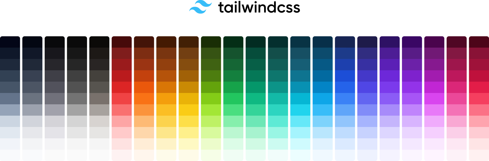
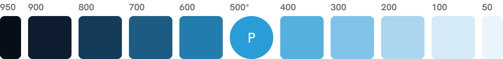
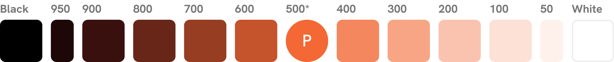
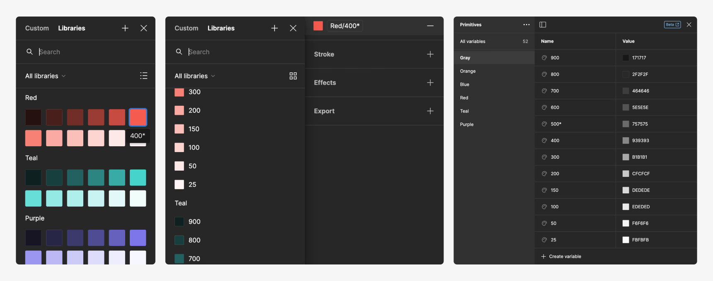
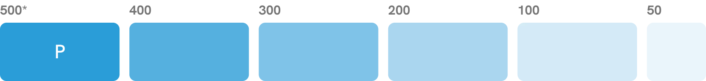
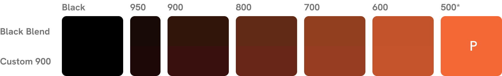
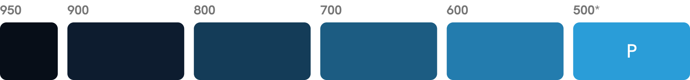
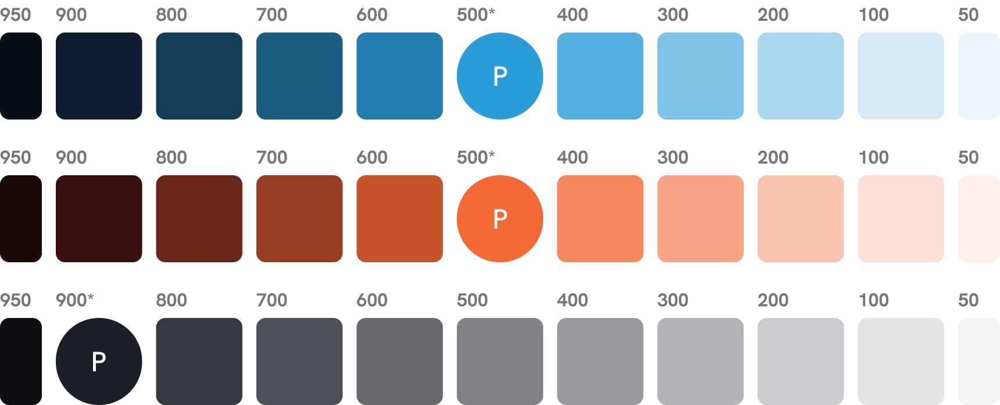

# Mastering Design System Colors

AUTHOR: Dreamten Team

POSTED: January 8th, 2024

LINK: https://www.dreamten.com/insights/mastering-design-system-colors

## Our Process for Creating Scalable Color Systems

**Color is a fundamental aspect of design, with the power to make or break a design system—and even cause major headaches for designers and developers alike.**

In this article, we’ll explore the advantages of using a numeric color scale. You will discover best practices and learn how to build a robust color system that will make design a breeze and developers happy.

_This methodology has been adopted by many industry leading companies and frameworks like [Tailwind](https://tailwindcss.com/) and was popularized by [Google Material](https://m2.material.io/design/color/the-color-system.html#tools-for-picking-colors) in 2014._

_Tailwind's color system demonstrates the numeric color scale model on a mass scale. Most projects won't need this many color options, however._

## Numeric Color Scale

A numeric color scale is comprised of a primary color supplemented with tints and shades. The primary color is usually assigned the value of 500, while higher numbers (900-600) represent darker shades and lower numbers (400-50) represent lighter tints. The complete color scale for a single hue would look something like this:

_A typical color scale would include a range of major steps (900-100) and a single minor step (50). However, I recommend including a minor step on the shade end (950). This can be extremely helpful when working with dark mode—more on this later._

The numeric sequence assumes that 1000 represents black, 0 represents white, and each step in the scale is an even progression along the way.

_In a proper color scale, shades are an evenly stepped progression toward black and tints are a progression towards white with the primary color in the middle._

Half steps (also called minor steps) are the exact midpoint between adjacent steps (also called major steps). For example, Orange 50 would be the exact midpoint between Orange 100 and white.

> [!NOTE]
> This numeric naming convention was derived from font weight assignments in CSS, where 400 represents “normal,” 700 represents “bold,” and 100 represents “thin.”

Initially, you may question the need for this many color values. However, in product design, subtle color variations are essential for interactive states such as button hover and focus. On screens with a lot of information, these subtle changes help guide the user by indicating the order of importance. While there are various ways to establish hierarchy, color, when combined with font and spacing, has been proven to be highly effective.

Having a diverse color palette is essential not just for product design, but also for web and print design. Designers often face the challenge of establishing hierarchy and subtlety and are forced to use transparency or create unique one-off colors. However, it’s much better to have a consistent color palette to maintain brand uniformity across different mediums.

## Benefits

### Consistency

Rather than creating inconsistent one-off colors here and there, defining a full range of tints and shades of each color allows you to ensure there is an option for every need. Instead of having 5 different tints of gray lines, you have one consistently used across the brand. Instead of having to create subtle color changes on the fly for hover states, just increment the value one step, ensuring that same color is used throughout where needed.

### Dark Mode Ready

Whether you’re building for dark mode now or later, by creating the full range of colors (particularly shades) you’ll be ready for it whenever that day comes. If you establish the colors now, you won’t have to create dark mode specific palettes or reconfigure your entire color system later.

### Eliminate Subjective Names

Naming things can be challenging, especially when you want them to be easily understood by anyone. Instead of using ambiguous names like "Lightest Gray," "Light Gray," "Dark Gray," and "Darkest Gray," a numeric scale would provide a universally understandable solution.

### Easy Handoff

Color palettes with irregular steps or subjective language can create headaches for the whole team, even the designer who created them. By adopting the numeric color scale methodology, you can enhance collaboration between the design and development teams and facilitate smoother handoffs to other designers or team members in the future.

### Scale Design Systems Effectively

One of the biggest challenges of scaling a product or design system is having to refactor old components, especially when the underlying foundation changes. By establishing a robust color system from the start, you can avoid difficulties associated with modifying or incorporating new colors in the future.

## Criticisms

Opinions on color in the design community are diverse, but I haven't come across any criticism of the numeric color scale that remains unanswered. Here are responses to the most common criticisms.

### Unnecessary Complexity

Some critics of numeric color scaling assert that it creates unnecessary complexity. While it certainly adds more base colors, the end result is a different kind of simplification. You can spend less time thinking about color and spend more time on information architecture and problem-solving. Rather than worrying about having to compromise on color standards, and doing so inconsistently, you can just design.

### Cognitive Overload

When viewing small color swatches in a design tool, it can be challenging to distinguish between colors and may feel overwhelming. However, when looking at larger areas of color, such as floods of color, the differences in color are much more noticeable and serve a purpose. Using the numeric naming convention, in-tool descriptions, and aliases/tokens can help make color selection much easier.

_In Figma, variables are sorted by collection in the color picker and the name appears on hover or beside the color in list view. By using the tool’s native organization, it becomes rather easy to understand and pick from the color system._

### Code Bloat

Code bloat is a genuine concern, especially for brands at scale—however, by removing one-off colors you can actually reduce the size of your codebase. And by leveraging a system like [Tailwind Just-in-Time](https://v2.tailwindcss.com/docs/just-in-time-mode) (the default in Tailwind 3+), your production code only includes what you actually use.

## How to Create a Color Scale

### 1. Define Brand Colors

To start, you’ll need to determine your primary brand colors if you haven’t already. Once you have those, you’ll need to assign each one a numeric value in hue-specific scales (each hue should have it's own scale). Ideally, brand color primaries (with neutrals being an exception) would be in the middle of the scale (e.g. 400 or 500), but this may not always be appropriate and shouldn’t be forced. By doing this, you will better ensure that you have a full range of tints and shades, which are particularly handy in UI design for things like borders, background accents, and interactive states.

Often colors that fall naturally in the middle of a scale, like we’re building here, are accessible on both dark and light. We won’t get into accessibility or the merits of lightness/darkness of brand colors in this article, but this is important to consider and may warrant tweaks to your base colors.

Pick one of your hues to build the first color scale for, you can circle back to the others after the first one is complete.

_A typical brand color system is comprised of unique neutral, primary, and accent colors._

### 2. Create Tints

To do this, you’ll need to blend your selected primary color down to white in even steps. Assuming your primary is assigned the 500 value, you’ll have 4 major steps (not including 50, since that’s a minor half-step). This is assumed in all of the following instructions. If your primary is assigned 400, you’d only have 3 steps and the percentages would be different throughout this guide.

You can manually create these steps by duplicating your primary color and adjusting the lightness (HSL) in even increments towards white. However, this requires manual calculations based on the lightness value of your primary color to ensure even steps.

Alternatively, you can overlay transparent white on the primary color and use the eyedropper tool to obtain the new color. Because we don’t want white to be in the color scale, we need to offset the number of steps by one, giving us ⅕ increments of transparency (i.e. 20%, 40%, 60%, and 80% for 400-100, respectively).

_Don’t forget to use the eyedropper to flatten your tints for use in your color scale._

Once you’ve built the 100 value, duplicate it and overlay 50% transparent white to create the half step (50).

_A normal color scale's tints include 4 major steps and a single minor step at the end._

> [!TIP]
> There are numerous tools you can use to build color scales for you, but I’ve found manually building them allows for the most flexibility and easier tweaking. At the end of the article, I’ll link to a couple of tools that do a decent job at building color palettes for you.

### 3. Create Shades

The blending model used above for tints can be followed for shades as well, but I’ve found that dark values require more saturation to make the hue perceivable (especially when used with typography). Not to mention, without tweaks, blending to black creates colors that feel a bit muddy.

_The top half of each block shows the steps blended with black. In this example, the saturation and hue were adjusted on the bottom to make a more pleasant, and noticeable, color._

With that said, starting with a black blended shade for the 900 value can be helpful to ensure the step progression is smooth and consistent. To get this, overlay 80% transparent black over your primary color. Use the eyedropper to grab the flattened color.

From here, you can tweak the hue and saturation of the 900 value as needed—but you should ensure that the “value” doesn’t change (this is generally controlled by lightness (HSL), but tweaking saturation significantly can cause a perceivable value change, and may need to be compensated with lightness).

Afterward, blend from that 900 value to your primary color in even steps. Assuming your primary is 500, you’ll have 3 steps in between. Since we already have our 900 value, we’ll need to offset this by one, giving us ¼ increments (i.e. 75%, 50%, and 25% for 800-600 respectively).

Most color scales do not include a 950 value, but I’ve found this to be very helpful to have particularly when working with dark mode. There’s a reason the 50 value exists, where 100 is often too stark of a change from white for subtle backgrounds. This is also true in dark mode. Not to mention, you can now simply invert your color values in dark mode (where 50 becomes 950, 100 becomes 900, 200 becomes 800, etc.).

To create the 950 minor step, overlay 50% transparent black on your 900 value. _You shouldn’t have to tweak this one since the 900 value was already optimized._

_A typical color scale's shades include 4 major steps with no minor steps. However, as noted, I recommend including a minor step on the end (950)._

> [!TIP]
> If you need to create additional half steps in your scale, overlay adjacent colors at 50% opacity.

### 4. Tweak & Repeat

Sometimes, this process can result in slightly muted colors and may require manual tweaking. You can do this by manually adjusting the saturation value (HSL) on a color-by-color basis. Keep in mind that this value should be blended between colors to ensure a smooth and gradual step across your color scale.

_Here you can see the full scale created using the steps above. Notice the smooth progression from step to step._

Once you’ve determined the full range of tints and shades, you can duplicate this process for your other brand colors.

It is important to maintain consistent saturation and lightness (HSL) values across different hues in your color system (e.g. Blue 200 vs Green 200). Doing so will make it easier to predictably use your colors in the future, both for yourself and others. For example, you could assign 50 to backgrounds, 100 to lines, 500 to key elements, and 700 to text regardless of the hue.

_The process outlined above was duplicated for the other primary colors, but the gray was approached a little bit differently. 950 was blended to black (50% transparent black overlayed on 900), but the remainder of the steps were blended down to white in ⅑ increments (11%)._

> [!TIP]
> You can quickly test for value consistency across hues by squinting your eyes. For a more precise evaluation, convert your entire color palette to grayscale and compare.

## Key Takeaway

By following the step-by-step process above, you can quickly create a complete color system including tints and shades. Color scales better ensure consistency throughout your brand, facilitate smoother collaboration, allow you to scale your design system as you grow, and enable you to focus on problem-solving.

## Quick Tips

- **Use descriptions, color aliases, and design tokens to document how a color should be used.** This should also be included in design system documentation, but nothing beats having that context directly in your tool of choice.

- **Consider including asterisks next to your primary values** for quick discoverability (e.g. Blue 500\*).

- **Use an “A” prefix when you situationally need a more saturated color** (e.g. Blue A500). Google Material introduced this idea rather than developing a full scale for color derivations. The "A" stands for alternative.

- **Don’t use brand colors to communicate semantic meaning.** Within product design, it's critical to have colors that communicate meaning for things like errors (red), warnings (orange), and success states (green). When colors are used interchangeably, they can lose their meaning altogether. If your brand color is orange, for example, consider creating a yellow scale to indicate warnings instead.

- **If you need more subtle changes between color values, introduce minor steps.** For example, we introduced a half-step at the end of the color scale (950) to enable more subtle backgrounds in dark mode. [Tailwind also adopted this pattern.](https://tailwindcss.com/blog/tailwindcss-v3-3#extended-color-palette-for-darker-darks)

- **Consider accessibility as you build your scale.** You'll want to ensure you have a range of color options that are accessible on your lightest and darkest backgrounds to enable variance and hierarchy.

- **The color change from hue to hue should be substantial.** If you can’t differentiate your hues or values across scales, they'll likely confuse users and ultimately undermine your product. If they’re similar, consider merging the colors into a single scale.

## Helpful Tools

[UI Colors](https://uicolors.app/create) — Provide your brand color, and receive a nearly perfect color scale. The tool offers advanced settings to fine-tune the scale and provides previews of the colors on common interface components. You can also use this tool directly in Figma through their plugin.

[ColorBox](https://colorbox.io/) — This tool provides extensive control over color progression and enables you to insert minor steps at any desired position in the scale. However, it can be a bit more challenging to use when you already have a specific color to work with.
