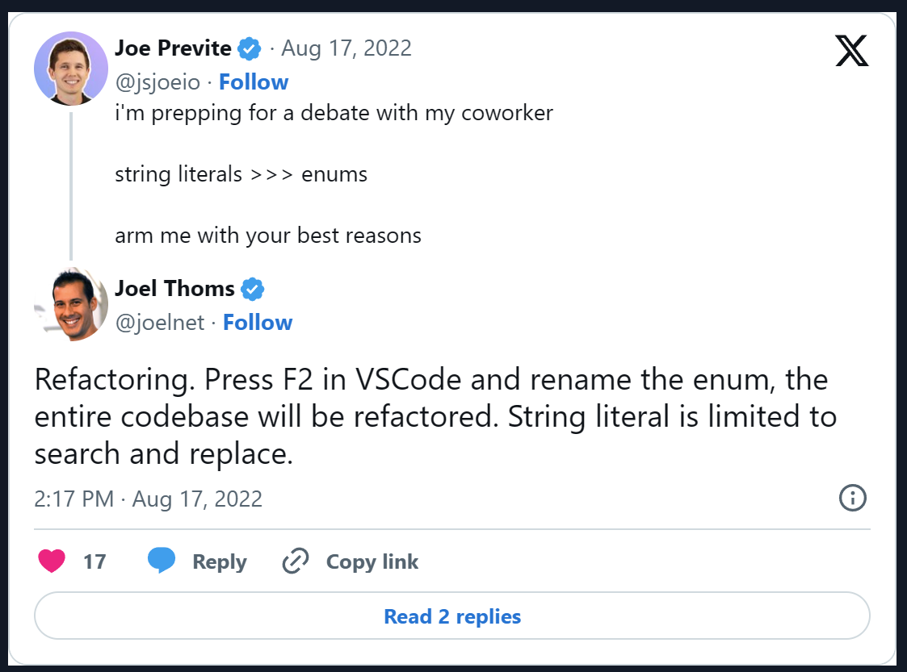
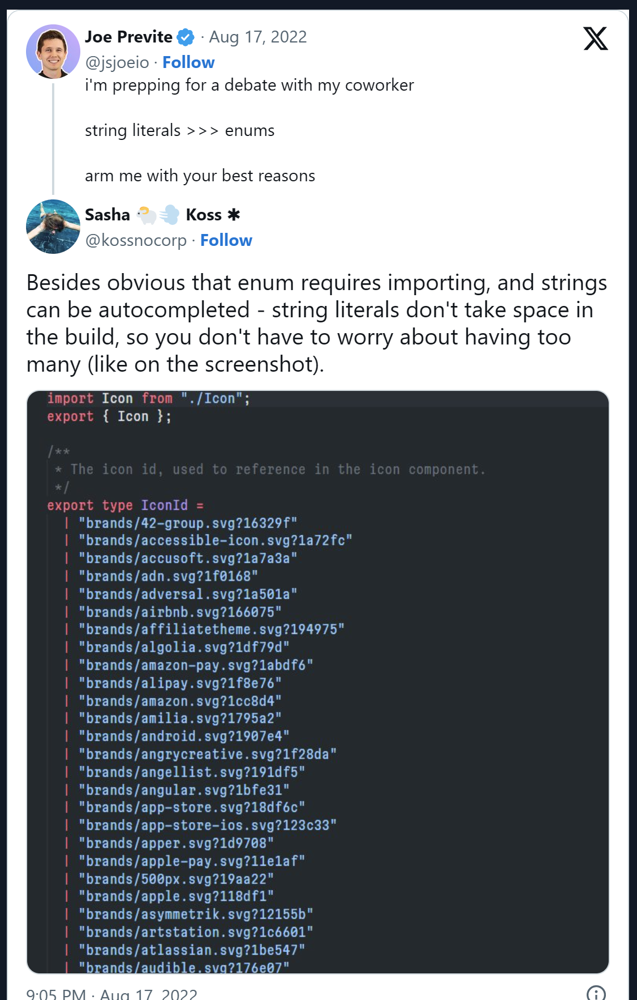

# Why You Should Use String Literal Unions Over Enums in TypeScript

_AUTHOR: Joe Previte_

_POSTED: September 14th, 2022_

_LINK: [https://www.typescriptcourse.com/string-literal-unions-over-enums](https://www.typescriptcourse.com/string-literal-unions-over-enums)_

In this article, we’ll explain why you should use unions over enums in your codebase. We’ll even include TypeScript playground links for our examples. This way, you can quickly try them yourself. By the end, you’ll be prepared to convince your team why the right move is unions over enums.

## Understanding Both Sides

> “Seek first to understand, then to be understood.”
>
> — Stephen R. Covey, The 7 Habits of Highly Effective People

If you want to convince your team to adopt one pattern over another, you need to understand both sides. This gives you the strongest position possible. We’re going to do that with today’s topic by practicing steelmanning. First, we’ll argue for enums, then we’ll argue for unions, specifically string literals.

By the end of it, you’ll know the strongest arguments for both sides and be able to convince your team which pattern to adopt and why. Let’s jump in!

:::tip
We assume you’re familiar with unions and enums. If you aren’t, read up on those first.
:::

### Show me the code

If you want to jump straight into code examples, take a look at these TypeScript playground links:

- enums
  - [not self-explanatory](https://www.typescriptlang.org/play?#code/KYOwrgtgBAyhCWAbYBPKBvAUFKAJAhgA6FoC8UARAFwCUFANNrPgCZTnUAUDmAvkA)
  - [logical reference](https://github.com/microsoft/vscode/blob/4bd12af7f6f4b4a3ce45d5aba48fdb60bb5ea68b/extensions/git/src/log.ts#L12-L23)
- string literal unions
  - [used directly](https://www.typescriptlang.org/play?#code/KYOwrgtgBAIglgJ2AYwC5wPYgKLmgbwCgooBVABygF4oAiMc2gGmNgwHcRq6ATDkZqwAywAGaputADZjUgkgCU4AcwAWEmrQQr1ggL6FCqAJ7lgsRCnRYhcVMAQBDKZIa0oAH1793X6bN86bTU5AG5DUTAQNEwuURAAdTtVXEgACh5EAC4LJBisVIgASih8A0jo6zjE5Nt7JykM7NyrWLqHZxKyw2QsAGcJR1dGcMJ4pNRVdoa0xyLQqAB6RagAKzABqHYMBABrPsNlqABBBGVIUAkMUSgTMygAcnpGB6g4PqgQDEG+vpUQRwAIxktwwUHIjicEGA9Sg11upnMD3geSqhQeADoxjVJoVZvMlisAEIAeRJAFkmJ8OFBjBgwJ9gMAeFANuZJuZQJAoJlUVJjFS7ihHJsdlA+hhoXCOQgoI5yOQEBhHMhVIAyAiAA)
  - [no duplicates](https://www.typescriptlang.org/play?#code/KYOwrgtgBAogbqALjc0DeAoKUDKMByAIlALxQBEeR5ANFlAEowDCMAkgGoykVOucxaGAL4YMiAJ4AHYLAQhEORACcAliADmPSgULkoAH14t2XcgG4gA)
  - [no imports needed example](https://codesandbox.io/p/github/jsjoeio/create-express-ts/draft/magical-dust?file=%2Fsrc%2Fother.ts&workspace=%257B%2522activeFileId%2522%253A%2522cl7y91ze500bi3b6h36lm0kjb%2522%252C%2522openFiles%2522%253A%255B%2522%252FREADME.md%2522%252C%2522%252Fsrc%252Fhello.ts%2522%252C%2522%252Fsrc%252Fother.ts%2522%252C%2522%252Fpackage.json%2522%255D%252C%2522sidebarPanel%2522%253A%2522EXPLORER%2522%252C%2522gitSidebarPanel%2522%253A%2522COMMIT%2522%252C%2522sidekickItems%2522%253A%255B%257B%2522type%2522%253A%2522TASK_LOG%2522%252C%2522taskId%2522%253A%2522build%2522%252C%2522key%2522%253A%2522cl7y97l6z01am3b6h0m21hq38%2522%252C%2522isMinimized%2522%253Afalse%257D%255D%257D)
  - [runtime and compile time example](https://www.typescriptlang.org/play?#code/MYewdgzgLgBAJgSwE4FNhQeCBBCBlKJBMAcxgF4YBtAIgFcAHGgGhhrhAHcwW2AbFADMovGkRIALEQF0YAQwgxQkKAG4AUAHpNMOmExh4KIgDcUcGIKQgAtjCR6MNlDBNy+dFOqgBPBi4ARZDQMcAoYX38QQXhg9AMcfEJiEiowOhsAI2NpDW0YAoA9AH51ZQgQAQA6PhASAAp1AoADABUJF0FK2s4U+VRXdwQLRFR4rAiQGBsQMxgfEDokGAY+OR9jAC4YABIAb1GQhNwCIlImgpgqgCsQYnrRAEoLgqrkm3rHgF9m9UeNIA)

## Arguments in favor of Enums

Although I’m not in the enum camp, these are some of the strongest arguments I’ve heard from enum supporters.

### Enums are quick to refactor

As Joel points out, most IDEs have a way to rename a symbol (like an Enum) and it will automatically do it throughout your entire codebase.



:::tip
We’re strictly comparing unions of string literals to string enums but do know that this type of refactoring work for objects so something to keep in mind.
:::

### Enums can be marked as deprecated

Wes Souza shared a fantastic example of this on Twitter:


As you can see the banana is annotated with TSDoc as @deprecated and IDEs will then strikethrough this so you know it’s deprecated.

### Enums are helpful when value is not self-explanatory

Sometimes strings aren’t self-explanatory and need some type of label. Enums work well for this.

```ts
enum Smiley {
  Happy = ":)",
  Sad = ":(",
}
```

h/t to [Pedro Figueiredo](https://twitter.com/P_FFigueiredo) for [mentioning this](https://twitter.com/P_FFigueiredo/status/1542450540281532418?s=20&t=qE9FbcOsw8_WWTFOG0HJyA).

### Enums work well for logical references

One of the most common use cases for enums is log levels. For instance, VS Code defines this:

```ts
/**
 * The severity level of a log message
 */
export enum LogLevel {
  Trace = 1,
  Debug = 2,
  Info = 3,
  Warning = 4,
  Error = 5,
  Critical = 6,
  Off = 7,
}
```

This might be more difficult or less readable using a union of string literals.

## Arguments in favor of Unions

Below are some of the strongest arguments I’ve found from those who believe unions should be used in place of enums.

### No code emitted

TypeScript is often described as “syntax for types” meaning it disappears after it’s compiled to JS. Enums break that rule. They can be compiled to JS, thus increasing the bundle size.

However with a union of string literals, no code is emitted aka no increase in bundle size. This means you can have a long list of string literals in a union without an increase in bundle size.



h/t to [Sasha Koss](https://twitter.com/kossnocorp) for the example.

### Strings are native to JS - Enums aren’t

Learning TypeScript is tough. There are a lot of TypeScript-specific things you end up having to learn. And that adds to the amount your team has to learn. If you stick with a union of string literals, you reduce the need to know enums.

No need to remember any knowledge about enums and their quirks. And, your codebase stays closer to JS.

### String literal unions can be used directly

When you use a string literal union, it just works. With an enum, you are locked into using that throughout your app - even if the enum is technically the same value as your string. This can cause issues with things that may come from external sources i.e. API responses and you suddenly have to cast to enums manually.

Here is an example which demonstrates string literals “just working.”

```ts
enum DirectionEnum {
  Up = "up",
  Down = "down",
  Left = "left",
  Right = "right",
}

type DirectionLiteral = "up" | "down" | "left" | "right";

function fnWithEnum(dir: DirectionEnum) {}
function fnWithLiteral(dir: DirectionLiteral) {}

const a = "up";

fnWithLiteral(a); // just works

// Argument of type '"up"' is not assignable to parameter of type 'DirectionEnum'.
fnWithEnum(a); // BOOM, now you need use the enum directly, typecast or some other approach...
```

h/t to [Fabien Bernard](https://twitter.com/fabien0102) for this [great example](https://twitter.com/fabien0102/status/1560196269158572033?s=20&t=1xSnRyMu9SlSmiI75K7OVw).

### No need to duplicate key & value

Oftentimes when you use enums you have to duplicate the key and the value. With a union, you don’t:

```ts
enum EventEnum {
  SEND = "SEND",
  RECEIVE = "RECEIVE",
}

type EventString = "SEND" | "RECEIVE";
```

String literal unions save you a lot of duplication and a lot of keystrokes.

### No imports needed

Enums have to be used directly whereas unions work without imports. See this example:

```ts
// fileA.ts
export enum EventEnum {
  SEND = "SEND",
  RECEIVE = "RECEIVE",
}

export type EventString = "SEND" | "RECEIVE";

export function logEvent(event: EventString) {
  console.log(`type of event: ${event}`);
}

export function logEventEnum(event: EventEnum) {
  console.log(`type of event: ${event}`);
}

// fileB.ts
import { EventEnum, logEvent, logEventEnum } from "./other";

// no import needed
logEvent("SEND");

// can't use string directly
// import needed
logEventEnum("SEND");
logEventEnum(EventEnum.SEND);
```

### Runtime and compile time access to list

Depending on how you define your union of string literals, you may be able to get both runtime and compile time access. Here is an example where we define directions as a const array of string literals. We then derive the type from it and have access at runtime:

```ts
const directionsAsString = ["up", "down", "left", "right"] as const;
// union derived from runtime value
type Direction = (typeof directionsAsString)[number];
//   ^? type Direction = "up" | "down" | "left" | "right"
console.log(
  `The following are valid directions to move your player: ${directionsAsString
    .join(", ")
    .trim()}`
);
```

Notice how they can also be joined easily because I used a runtime value to create my type value. Win-win!

### Resources

In case you didn’t realize, this is a spicy topic 🌶️. People have strong opinions about this topic. We’ve only touched the surface; we only covered string enums vs string literal unions. Here are some articles to read if you want to continue down this rabbit hole:

- [TypeScript Handbook: Enums](https://www.typescriptlang.org/docs/handbook/enums.html)
- [Tidy TypeScript: Prefer union types over enums](https://fettblog.eu/tidy-typescript-avoid-enums/)
- [TypeScript Features to Avoid](https://www.executeprogram.com/blog/typescript-features-to-avoid)
- [TypeScript Enums I Want to Actually Use](https://robinpokorny.com/blog/typescript-enums-i-want-to-actually-use/)
- [Stop SHOUTING = 'shouting'](https://swizec.com/blog/stop-shouting-shouting/)
- [With or without enums in TypeScript](https://blog.beraliv.dev/2022-09-10-with-or-without-enums)

## Which to use?

I side more with the union folks. I like the refactoring and the ability to use deprecated warnings with enums but those are things I rarely reach for. My favorite feature of unions is deriving the type from a runtime value. It feels it’s closer to JS and I prefer that.

With all “best practices” the most important thing you can do for your team is choose what best fits your codebase. You now have the best arguments for both sides which means you’re well-equipped. Now consider the tradeoffs for reach, choose your side and make your case. Good luck!

### Thank you to TypeScript Community

I want to thank everyone who responded to my tweet when I asked for help arguing for string literals [unions]. This couldn’t have been written without you!

Also, special thanks to [Cody](https://twitter.com/Mager1794), [Alexey](https://twitter.com/beraliv), and [Simon](https://twitter.com/srsholmes) for providing feedback on the first draft.
