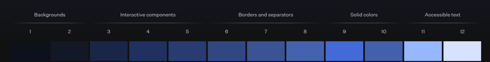
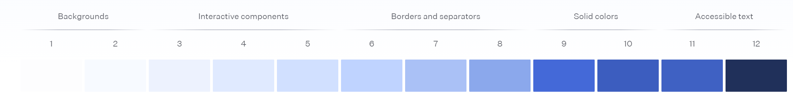

import Tabs from "@theme/Tabs";
import TabItem from "@theme/TabItem";
import ThemeSelectorNEXTjs from "./tailwind-css-partials/_theme-selector-nextjs.md";
import ThemeSelectorAngular from "./tailwind-css-partials/_theme-selector-angular.md";
import ThemeSelectorVue from "./tailwind-css-partials/_theme-selector-vue.md";

# Theme Configuration

## Base Styles

See the following documentation about defining base styles in Tailwind

- [Adding Base Styles](https://tailwindcss.com/docs/adding-custom-styles#adding-base-styles)
- [Extending Preflight](https://tailwindcss.com/docs/preflight#extending-preflight)

## Color System

:::tip
See article [Mastering Design System Colors](../../../articles/mastering-design-system-colors) that explores the advantages of using numeric color scales and explains how to create them.
:::

Tailwind has an extensive, sequentially scaled color palette defined by default. In practice I have found most sites benefit from a smaller scaled color palette that uses the following meaningful names for the accent color variables (inspired by [Material UI](https://mui.com/material-ui/customization/palette/#default-colors)).

- **PRIMARY** - For primary interface elements.
- **SECONDARY** - For secondary interface elements.
- **DANGER** - For elements that the user should be made aware of.
- **WARNING** - For potentially dangerous actions or important messages.
- **SUCCESS** - For indicating the successful completion of an action that the user triggered.
- **INFO** - For highlighting neutral information.
- **GRAYSCALE** - For neutral elements, accents, and backgrounds.

:::tip
Tailwind allows us to [override, disable, or expand the default color palette](https://tailwindcss.com/docs/colors#customizing-your-colors)
:::

Example of the primary sequential color scale as Tailwind theme variables:

```css
@theme {
  --color-primary: oklch(34.8% 0.125 258.71);
  --color-primary-50: oklch(96.51% 0.01 252.81);
  --color-primary-100: oklch(93.83% 0.018 261.34);
  --color-primary-200: oklch(86.78% 0.038 256.97);
  --color-primary-300: oklch(77.67% 0.066 258.62);
  --color-primary-400: oklch(67.09% 0.1 257.79);
  --color-primary-500: oklch(49.97% 0.125 258.51);
  --color-primary-600: oklch(46.66% 0.115 258.26);
  --color-primary-700: oklch(41.48% 0.1 258.37);
  --color-primary-800: oklch(37.26% 0.088 258.17);
  --color-primary-900: oklch(27.24% 0.058 257.99);
  --color-primary-950: oklch(21.26% 0.04 258.28);
}
```

:::info
`oklch()` is a modern CSS color function that represents colors using the OKLCH color space, which stands for Lightness (L), Chroma (C), and Hue (H) based on the perceptually uniform OKLab model.

Why use `oklch()?`

- **Perceptual Uniformity**: Changes in lightness, chroma, or hue are visually consistent, making color adjustments more predictable and accessible.
- **Better Gradients**: Color scales and gradients look smoother and more natural compared to RGB or HSL.
- **Accessibility**: Easier to create accessible color palettes with consistent contrast.
- **Future-Proof**: Supported in modern browsers and recommended for design systems and theming.
  :::

Follow these steps for each color to create a custom color palette in Tailwind:

1. Given a color as a hex code, convert it to a `oklch()` using a [oklch converter](https://oklch.com/#50,0.1,245,100). Save this value in a css variable. (This is usually an official brand color that is useful to keep around)
2. Modify the first parameter of that value to be `50%` and get the hex value. This will be the `500` value in a sequential color scale.
3. Enter that hex value into the [tints.dev](https://www.tints.dev) Palette Generator.
4. Select the `oklch` option from the `hex/p-3/oklch/hsl` field.
5. Toggle on `luminance` from the `Luminance/Lightness` field.
6. Scroll down and save the generated tailwind css variables for tailwind v4.0.

## Light and Dark Mode Intro

:::info
Tailwind Dark Mode Documentation: [https://tailwindcss.com/docs/dark-mode](https://tailwindcss.com/docs/dark-mode)
:::

Enabled by default, Tailwind toggles dark mode by using the `prefers-color-scheme` media query. For styles to target dark mode they need to be prepended with `dark:`. Ex:

```html
<html className="bg-gray-100 dark:bg-gray-900">
  . . .
</html>
```

### 🔥 HOT TAKE #1 - User's Should Have More Control

A better user experience would be to allow the user to manually select between `light`, `dark`, and `system`. Tailwind explains how to [toggle dark mode manually](https://tailwindcss.com/docs/dark-mode#toggling-dark-mode-manually), including [with system theme support](https://tailwindcss.com/docs/dark-mode#with-system-theme-support).

🔑 Key takeaways from these guides:

- One of the following definitions is necessary for any implementation that involves a manual toggle.
  - Class attribute: `@custom-variant dark (&:where(.dark, .dark *));`
  - Data attribute: `@custom-variant dark (&:where([data-theme=dark], [data-theme=dark] *));`
- To prevent FOUC (Flash Of Unstyled Content) on page load, the class or data attribute on the `<html>` element needs to be set by:
  - Server side rendering when the user's preference is stored remotely.
  - An inline script in the `<head>` when user's preference is stored in `localStorage`.
    - This method prefers data attribute over class attribute. This is because the class attribute may be overridden by your framework (e.g. React, Angular, Vue).

### 🔥 HOT TAKE #2 - Could be More Resilient

Every component/element has to remember to define a light style AND and dark style. Ex:

```html
<html className="bg-gray-100 dark:bg-gray-900">
  . . .
</html>
```

That feels a bit brittle. It'd be nicer if we could use one css color variable and swap the value of that variable when in dark mode.

[Radix UI](https://www.radix-ui.com/colors/custom) provides some inspiration for how we might organize colors instead.





The idea is not an exact 1:1 to what Radix is doing above, but here it is. Our custom theme variables could use the number range 0 - 10 where the lower numbers are intended as background colors, and higher numbers are intended as foreground colors. Inverting the scale is the difference between light and dark mode. For example, in light mode the `--theme-color-primary-0` color would be set to the value of `--color-primary-50`, and in dark mode it would be set to the value of `--color-primary-950`. Likewise, `--theme-color-primary-10` would be set to `--color-primary-950` in light mode and `--color-primary-50` in dark mode.

:::warning
You might be wondering why we are using a 0 - 10 range instead of the 50 - 950 range. That's because conventions dictate that tints in a color scale should be ordered from lightest to darkest, where 50 is the lightest shade and 950 is the darkest shade.
The 0 - 10 range defined in this guide is a custom range used to define our own color scale that is allowed to be inverted for dark mode
:::

## Implement Light and Dark Mode

### Color Palette CSS

Create a `./styles/color-palette.css` file. The `./styles` directory should be in the same place as the css file that contains the `@import "tailwindcss";` statement:

```css title="styles/color-palette.css"
/* ===================================== */
/* === DESIGN SYSTEM COLOR VARIABLES === */
/* ===================================== */
:root {
  /* 🎨 Colors defined by the design system */
  /* ⚠️ These variables are not meant to be used directly in the application */

  /* === Primary Color Scale === */
  --ds-color-primary: oklch(34.8% 0.125 258.71);
  --ds-color-primary-50: oklch(95.25% 0.021 259.19);
  --ds-color-primary-100: oklch(90.68% 0.041 256.24);
  --ds-color-primary-200: oklch(81.23% 0.087 257.17);
  --ds-color-primary-300: oklch(72.3% 0.132 257.02);
  --ds-color-primary-400: oklch(63.98% 0.177 257.44);
  --ds-color-primary-500: oklch(56.53% 0.217 259.51);
  --ds-color-primary-600: oklch(48.3% 0.181 259.2);
  --ds-color-primary-700: oklch(39.41% 0.143 258.97);
  --ds-color-primary-800: oklch(30.06% 0.105 258.52);
  --ds-color-primary-900: oklch(20.16% 0.058 255.74);
  --ds-color-primary-950: oklch(14.58% 0.035 248.24);

  /* === Secondary Color Scale === */
  /* === Danger Color Scale === */
  /* === Warning Color Scale === */
  /* === Info Color Scale === */
  /* === Success Color Scale === */
  /* === Grayscale Color Scale === */
}

/* =================================== */
/* === LIGHT THEME COLOR VARIABLES === */
/* =================================== */
:root {
  /* 🎨 Colors defined by the design system ordered lightest to darkest*/
  /* ⚠️ These variables are not meant to be used directly in the application */

  /* === Primary Color Scale === */
  --theme-color-primary: var(--ds-color-primary);
  --theme-color-primary-0: var(--ds-color-primary-50);
  --theme-color-primary-1: var(--ds-color-primary-100);
  --theme-color-primary-2: var(--ds-color-primary-200);
  --theme-color-primary-3: var(--ds-color-primary-300);
  --theme-color-primary-4: var(--ds-color-primary-400);
  --theme-color-primary-5: var(--ds-color-primary-500);
  --theme-color-primary-6: var(--ds-color-primary-600);
  --theme-color-primary-7: var(--ds-color-primary-700);
  --theme-color-primary-8: var(--ds-color-primary-800);
  --theme-color-primary-9: var(--ds-color-primary-900);
  --theme-color-primary-10: var(--ds-color-primary-950);

  /* === Secondary Color Scale === */
  /* === Danger Color Scale === */
  /* === Warning Color Scale === */
  /* === Info Color Scale === */
  /* === Success Color Scale === */
  /* === Grayscale Color Scale === */
}

/* ================================== */
/* === DARK THEME COLOR VARIABLES === */
/* ================================== */
[data-theme="dark"] {
  /* 🎨 Colors defined by the design system ordered darkest to lightest*/
  /* ⚠️ These variables are not meant to be used directly in the application */

  /* === Primary Color Scale === */
  --theme-color-primary-0: var(--ds-color-primary-950);
  --theme-color-primary-1: var(--ds-color-primary-900);
  --theme-color-primary-2: var(--ds-color-primary-800);
  --theme-color-primary-3: var(--ds-color-primary-700);
  --theme-color-primary-4: var(--ds-color-primary-600);
  --theme-color-primary-5: var(--ds-color-primary-500);
  --theme-color-primary-6: var(--ds-color-primary-400);
  --theme-color-primary-7: var(--ds-color-primary-300);
  --theme-color-primary-8: var(--ds-color-primary-200);
  --theme-color-primary-9: var(--ds-color-primary-100);
  --theme-color-primary-10: var(--ds-color-primary-50);

  /* === Secondary Color Scale === */
  /* === Danger Color Scale === */
  /* === Warning Color Scale === */
  /* === Info Color Scale === */
  /* === Success Color Scale === */
  /* === Grayscale Color Scale === */
}
```

### Tailwind Theme CSS

Then add the following in the same css file that contains the `@import "tailwindcss";` statement:

```css
@import "tailwindcss";
@import "./styles/color-palette.css";

/* ================================ */
/* === CUSTOMIZE TAILWIND THEME === */
/* ================================ */
/* NOTE:
`@custom-variant dark` is a Tailwind directive that overrides the `dark` variant to use a custom
selector: https://tailwindcss.com/docs/dark-mode#using-a-data-attribute
*/
@custom-variant dark (&:where([data-theme=dark], [data-theme=dark] *));

/* NOTE:
`@theme inline` is a Tailwind directive that allows the defining of variables that reference other
variables: https://tailwindcss.com/docs/colors#referencing-other-variables
*/
@theme inline {
  /* ============== */
  /* === COLORS === */
  /* ============== */
  /* 🟡 Disable the default color palette provided by Tailwind */
  /* --color-*: initial;*/

  /* === Primary Color Scale === */
  --color-primary: var(--theme-color-primary);
  --color-primary-0: var(--theme-color-primary-0);
  --color-primary-1: var(--theme-color-primary-1);
  --color-primary-2: var(--theme-color-primary-2);
  --color-primary-3: var(--theme-color-primary-3);
  --color-primary-4: var(--theme-color-primary-4);
  --color-primary-5: var(--theme-color-primary-5);
  --color-primary-6: var(--theme-color-primary-6);
  --color-primary-7: var(--theme-color-primary-7);
  --color-primary-8: var(--theme-color-primary-8);
  --color-primary-9: var(--theme-color-primary-9);
  --color-primary-10: var(--theme-color-primary-10);

  /* === Secondary Color Scale === */
  /* === Danger Color Scale === */
  /* === Warning Color Scale === */
  /* === Info Color Scale === */
  /* === Success Color Scale === */
  /* === Grayscale Color Scale === */
}
```

### Theme Selector Component

<Tabs>
  <TabItem value="nextjs" label="NEXT.js" default>
    <ThemeSelectorNEXTjs />
  </TabItem>
  <TabItem value="angular" label="Angular" default>
    <ThemeSelectorAngular />
  </TabItem>
  <TabItem value="vue" label="Vue" default>
    <ThemeSelectorVue />
  </TabItem>
</Tabs>

## Configure Typography

### Default Tailwind Fonts

:::info
Source: [Font Family Quick Reference](https://tailwindcss.com/docs/font-family#quick-reference)
:::

By default tailwind uses these fonts:

| Class      | Value                                                                                                                |
| ---------- | -------------------------------------------------------------------------------------------------------------------- |
| font-sans  | `ui-sans-serif, system-ui, sans-serif, 'Apple Color Emoji', 'Segoe UI Emoji', 'Segoe UI Symbol', 'Noto Color Emoji'` |
| font-serif | `ui-serif, Georgia, Cambria, 'Times New Roman', Times, serif`                                                        |
| font-mono  | `ui-monospace, SFMono-Regular, Menlo, Monaco, Consolas, 'Liberation Mono', 'Courier New', monospace`                 |

### Customize Fonts

:::info
Relevant Sources:

- [Using Custom Value](https://tailwindcss.com/docs/font-family#using-a-custom-value)
- [Customizing Your Theme](https://tailwindcss.com/docs/font-family#customizing-your-theme)
- [Overriding the default theme](https://tailwindcss.com/docs/theme#overriding-the-default-theme)

:::

```css
@theme {
  /* Override default fonts */
  --font-sans: /* Custom font-family value */ ;
  --font-serif: /* Custom font-family value */ ;
  --font-mono: /* Custom font-family value */ ;

  /* Declare custom fonts. Follow tailwind pattern `--font-*` */
  --font-heading: /* Custom font-family value */ ;
  --font-main: /* Custom font-family value */ ;
  --font-accent: /* Custom font-family value */ ;
  --font-code: /* Custom font-family value */ ;
}
```

### Customize Base Typography

:::info
Relevant Sources:

- [Adding Base Styles](https://tailwindcss.com/docs/adding-custom-styles#adding-base-styles)
- [Extending Preflight](https://tailwindcss.com/docs/preflight#extending-preflight)
  :::

```css
/* ==================================== */
/* === EXTENDING TAILWIND PREFLIGHT === */
/* ==================================== */
@layer base {
  /* ================== */
  /* === TYPOGRAPHY === */
  /* ================== */
  /* NOTE: font-size and line-height variables are defined by Tailwind CSS. Refer to https://tailwindcss.com/docs/font-size */

  body {
    font-family: var(--font-main);
    color: var(--color-primary-10);
  }

  a {
    color: var(--color-primary-6);
    text-decoration-line: underline;
  }

  h1,
  h2,
  h3,
  h4,
  h5,
  h6 {
    font-family: var(--font-heading);
  }

  h1 {
    font-size: var(--text-6xl); /* 3.75rem (60px) */
    line-height: var(--text-6xl--line-height); /* 1 */
    font-weight: 600;
  }
  h2 {
    font-size: var(--text-5xl); /* 3rem (48px) */
    line-height: var(--text-5xl--line-height); /* 1 */
    font-weight: 600;
  }
  h3 {
    font-size: var(--text-4xl); /* 2.25rem (36px) */
    line-height: var(--text-4xl--line-height); /* calc(2.5 / 2.25) */
    font-weight: 600;
  }
  h4 {
    font-size: var(--text-3xl); /* 1.875rem (30px) */
    line-height: var(--text-3xl--line-height); /* calc(2.25 / 1.875) */
    font-weight: 600;
  }
  h5 {
    font-size: var(--text-2xl); /* 1.5rem (24px) */
    line-height: var(--text-2xl--line-height); /* calc(2 / 1.5) */
    font-weight: 600;
  }
  h6 {
    font-size: var(--text-xl); /* 1.25rem (20px) */
    line-height: var(--text-xl--line-height); /* calc(1.75 / 1.25) */
    font-weight: 600;
  }
}
```

### NextJS Font Optimization

:::info

Relevant Sources:

- NextJS Font Optimization - [Google Fonts](https://nextjs.org/docs/app/building-your-application/optimizing/fonts#google-fonts)
- NextJS Font Optimization - [Local Fonts](https://nextjs.org/docs/app/building-your-application/optimizing/fonts#local-fonts)
- NextJS Font Optimization - [With Tailwind CSS](https://nextjs.org/docs/app/building-your-application/optimizing/fonts#with-tailwind-css)

:::

```ts title="src/app/fonts/index.ts"
import { Lora, Roboto, Roboto_Mono } from "next/font/google";

export const lora = Lora({
  subsets: ["latin"],
  display: "swap",
  variable: "--next-optimized-font-lora",
});

export const roboto = Roboto({
  subsets: ["latin"],
  display: "swap",
  variable: "--next-optimized-font-roboto",
});

export const roboto_mono = Roboto_Mono({
  subsets: ["latin"],
  display: "swap",
  variable: "--next-optimized-font-roboto-mono",
});
```

```tsx title="src/app/layout.tsx"
import { lora, roboto, roboto_mono } from "@/app/fonts";
import "./globals.css";

export default function RootLayout({
  children,
}: Readonly<{
  children: React.ReactNode;
}>) {
  return (
    <html
      lang="en"
      className={`bg-primary-0 ${lora.variable} ${roboto.variable} ${roboto_mono.variable}`}
    >
      <body>
        <h1 className={"font-roboto"}>Hello World</h1>
        {children}
      </body>
    </html>
  );
}
```

```css title="src/app/globals.css"
/* ================================ */
/* === CUSTOMIZE TAILWIND THEME === */
/* ================================ */
/* NOTE:
`@theme inline` is a Tailwind directive that allows the defining of variables that reference other
variables: https://tailwindcss.com/docs/colors#referencing-other-variables
*/
@theme inline {
  /* ============= */
  /* === FONTS === */
  /* ============= */
  /* NOTE: --next-optimized-font-* variables are defined in src/app/fonts/index.ts*/

  /* === Override Default Fonts === */
  --font-sans: var(
    --next-optimized-font-roboto,
    ui-sans-serif,
    system-ui,
    sans-serif,
    "Apple Color Emoji",
    "Segoe UI Emoji",
    "Segoe UI Symbol",
    "Noto Color Emoji"
  );
  --font-serif: var(
    --next-optimized-font-lora,
    ui-serif,
    Georgia,
    Cambria,
    "Times New Roman",
    Times,
    serif
  );
  --font-mono: var(
    --next-optimized-font-roboto-mono,
    ui-monospace,
    SFMono-Regular,
    Menlo,
    Monaco,
    Consolas,
    "Liberation Mono",
    "Courier New",
    monospace
  );

  /* === Custom Fonts === */
  /* Follow tailwind pattern `--font-*` */
  --font-heading: var(--next-optimized-font-lora);
  --font-main: var(--next-optimized-font-roboto);
}
```

## Review and Configure Other Theme Variables

:::info
source: [https://tailwindcss.com/docs/theme#theme-variable-namespaces](https://tailwindcss.com/docs/theme#theme-variable-namespaces)
:::

Theme variables are defined in namespaces and each namespace corresponds to one or more utility class or variant APIs.

Defining new theme variables in these namespaces will make new corresponding utilities and variants available in your project:

| Namespace         | Utility classes                                                       |
| ----------------- | --------------------------------------------------------------------- |
| --color-\*        | Color utilities like bg-red-500, text-sky-300, and many more          |
| --font-\*         | Font family utilities like font-sans                                  |
| --text-\*         | Font size utilities like text-xl                                      |
| --font-weight-\*  | Font weight utilities like font-bold                                  |
| --tracking-\*     | Letter spacing utilities like tracking-wide                           |
| --leading-\*      | Line height utilities like leading-tight                              |
| --breakpoint-\*   | Responsive breakpoint variants like sm:\*                             |
| --container-\*    | Container query variants like @sm:\* and size utilities like max-w-md |
| --spacing-\*      | Spacing and sizing utilities like px-4, max-h-16, and many more       |
| --radius-\*       | Border radius utilities like rounded-sm                               |
| --shadow-\*       | Box shadow utilities like shadow-md                                   |
| --inset-shadow-\* | Inset box shadow utilities like inset-shadow-xs                       |
| --drop-shadow-\*  | Drop shadow filter utilities like drop-shadow-md                      |
| --blur-\*         | Blur filter utilities like blur-md                                    |
| --perspective-\*  | Perspective utilities like perspective-near                           |
| --aspect-\*       | Aspect ratio utilities like aspect-video                              |
| --ease-\*         | Transition timing function utilities like ease-out                    |
| --animate-\*      | Animation utilities like animate-spin                                 |
