# New Probe Request

## Launch by NTT Data | Client - Bio-Techne

Video - [https://youtube.com/watch?v=CYCLvpgWqqs](https://youtube.com/watch?v=CYCLvpgWqqs)

### Summary

- ℹ️ **Problem**: Customers often submitted invalid or incomplete requests for new probes. Additionally, requesting many probes requires multiple submissions of the same form.
- 💡 **Solution**: New form guides customers through the probe design process. Values for later fields are enabled based on values from previous fields. The new form also allows bulk for bulk upload from CSV file.
- 👨‍💼 **Role**: JavaScript lead of an agile development team with 2 junior devs and 2 UI/UX designers. Responsible for breaking down designs into stories. Worked on defining a design system. Mentored dev in code organization and use of code quality tools. Defined YAML pipelines for code quality checks for PRs and automated deployment on merge.
- 🎯 **Challenges**: Managing cross-field and cross-field-set validation in a way that allowed for future changes. State management for when different sections of the form would appear. Validating csv bulk upload and allowing quick edits before submission.
- 💻 **Technologies**: Angular and TypeScript, A11Y guidelines, Jest, Testing Library, ESLint, Prettier, Trunk Based Branching, Azure DevOps, Branch Policies, Azure Pipelines, Azure Static Web Apps.
- 🥇 **Result**: 90% code coverage for unit tests. Received positive feedback from the client and customers. Saved thousands of hours of manual effort.

### Entry Options

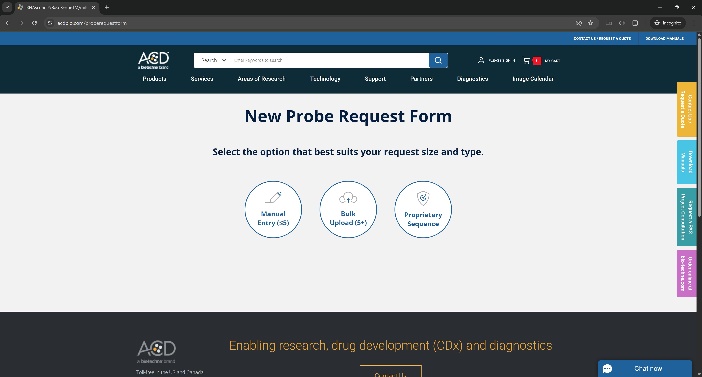

⬆️ First the customer choses how they would like to enter their request

<br />

### Manual Entry

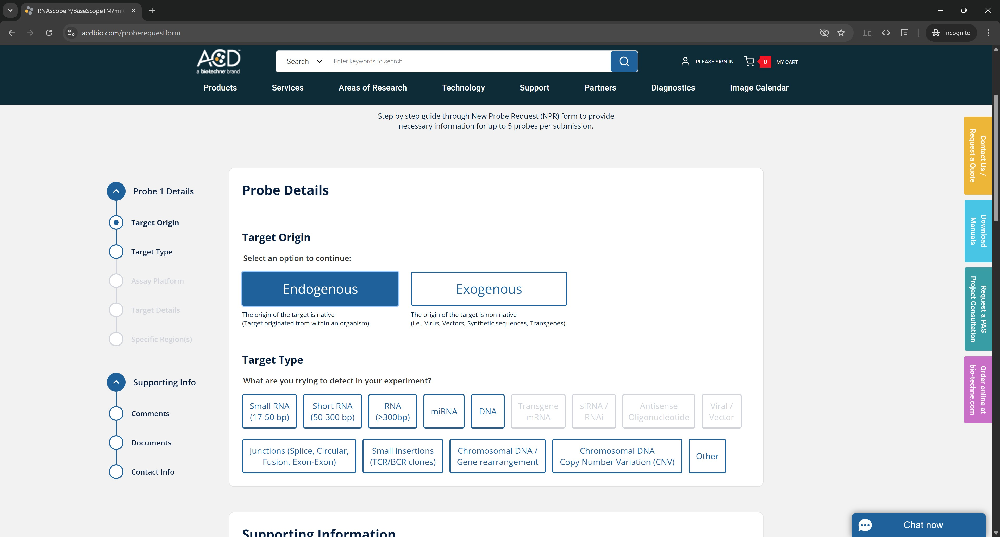

⬆️ The value of "Target Origin" determines what options are enabled for "Target Type".

<br />

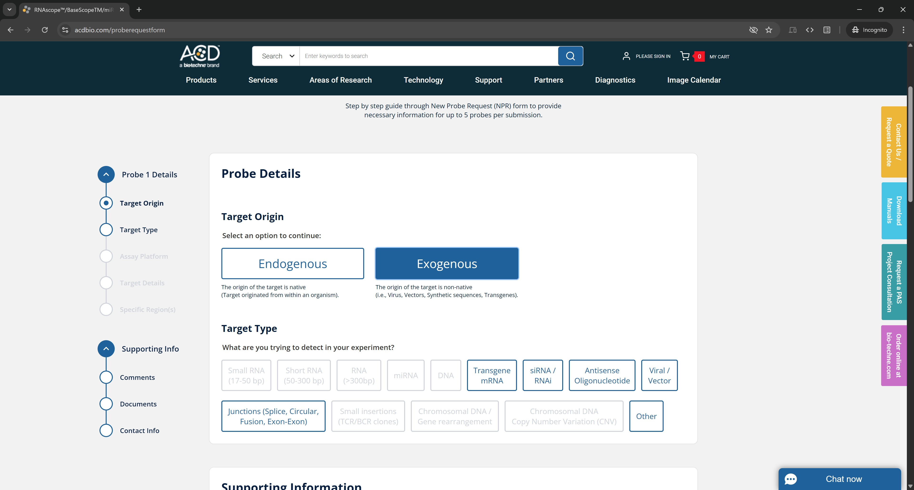

⬆️ The value of "Target Origin" determines what options are enabled for "Target Type".

<br />

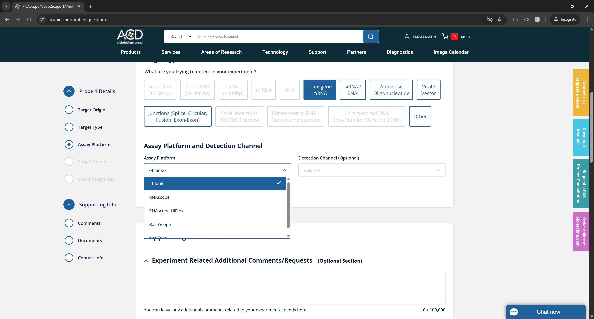

⬆️ Implemented custom select component that matched UI/UX designs. A11Y standards were taken into account when implementing and testing.

<br />

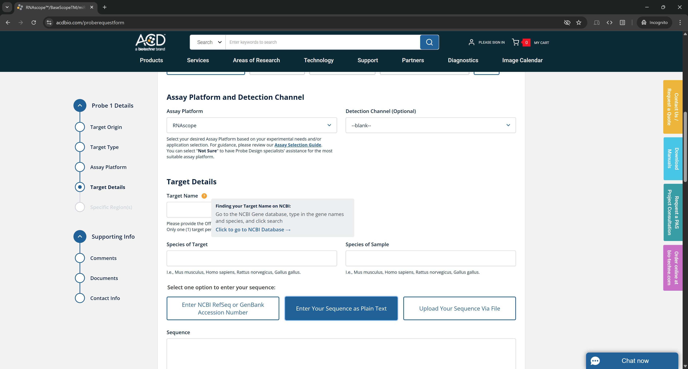

⬆️ More sections become visible as the customer fills out the form.

<br />

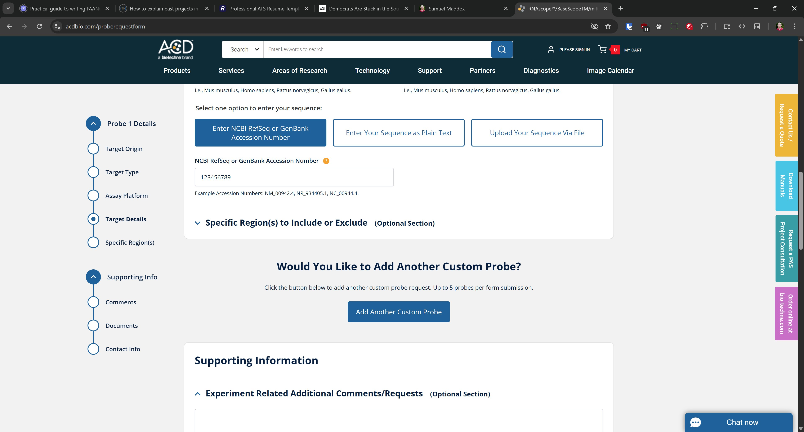

⬆️ Option to add another probe appears after the first probe is filled out.

<br />

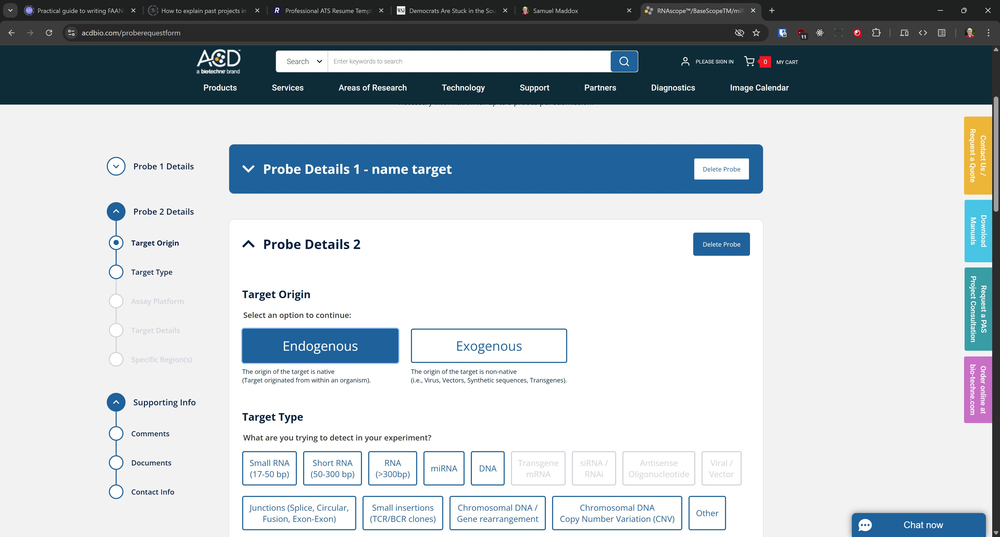

⬆️ After adding another probe, the first one is collapsed, including the sidebar, to make apparent which probe is being edited.

<br />

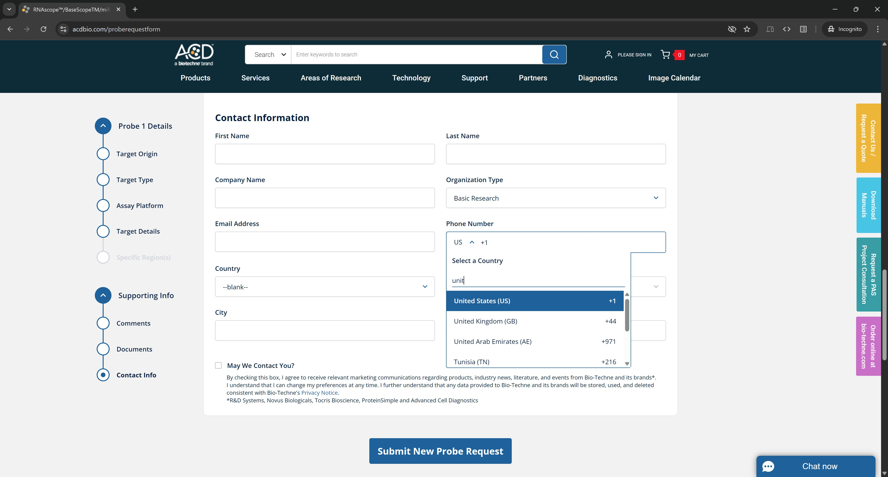

⬆️ Implemented custom phone number input that was built on top of the custom select component. This input allowed for autocompletion of the country code. A11Y standards were taken into account when implementing and testing.

<br />

### Bulk Entry

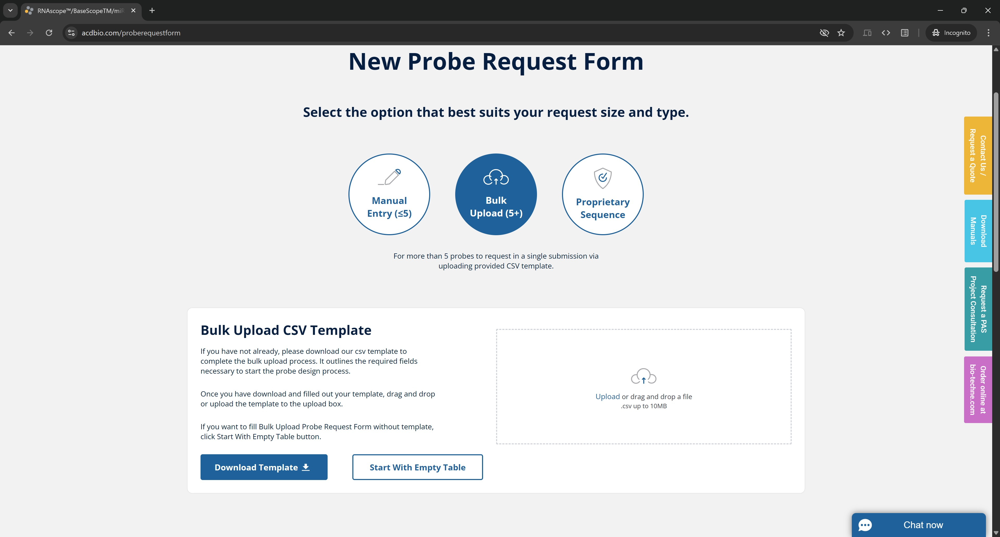

⬆️ Customer can download a CSV template to fill out that most customers open in Excel. It looks something like the following:

```csv
*========================================================================================,,,,,,
* Please do not change header row. (Row 13),,,,,,
* GenBank Accession Number OR target Sequence per target is required.,,,,,,
*,,,,,,
* Target Type Options:,Small RNA (17-50 bp),Short RNA (50-300 bp),RNA (>300bp),miRNA,DNA,Transgene mRNA,siRNA / RNAi,Antisense Oligonucleotide,Viral / Vector,"Junctions (Splice, Circular, Fusion, Exon-Exon)",Small insertions (TCR/BCR clones),Chromosomal DNA / Gene rearrangement,Chromosomal DNA Copy Number Variation (CNV),Other,,,,,,
*,,,,,,
* Assay Platform Options:,RNAscope,BaseScope,miRNAscope,RNAscope HiPlex,DNAscope,Not Sure,,,,,,
* 'Not Sure' Assay Platform: Probe design specialists will recommend the most suitable assay platform based on characteristics of the target.,,,,,,
*,,,,,,
* You can add notes and nucleotide sequence to the Sequence column (G),,,,,,
*=========================================================================================,,,,,,
,,,,,,
Target Type,Assay Platform,Target Name,Species of Target,Species of Sample,NCBI RefSeq or GenBank Accession Number,Sequence
```

<br />

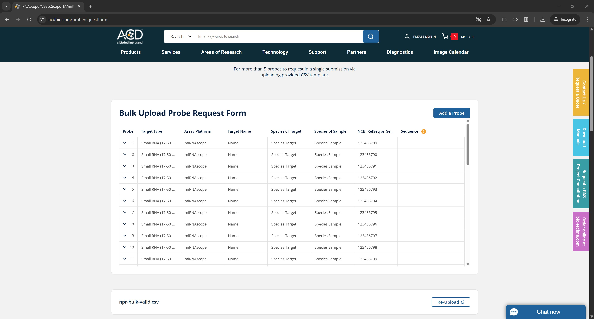

⬆️ Upon upload the data is displayed in a table before the customer submits the form.

<br />

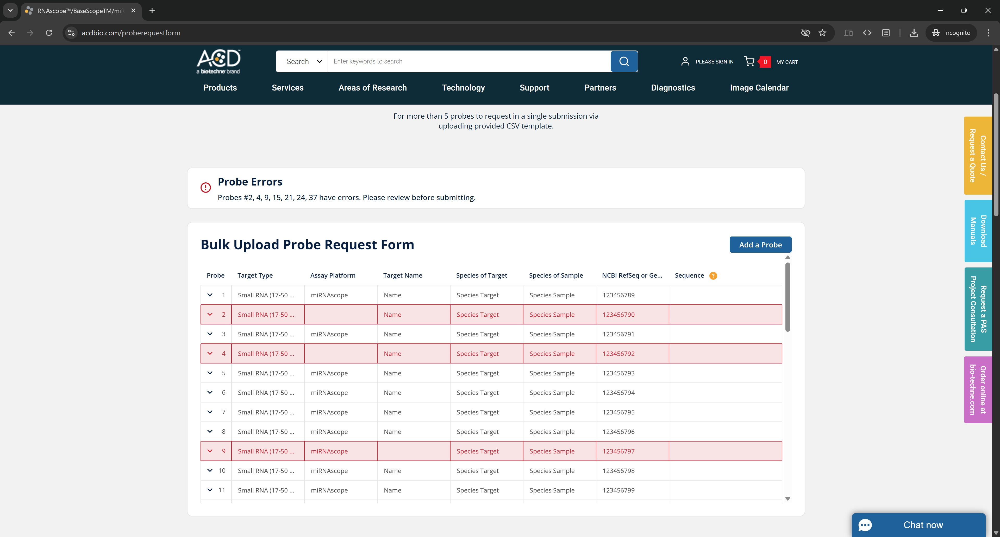

⬆️ If the CSV file contains invalid or missing values, the customer is notified what rows contain errors and can edit the data in the table.

<br />

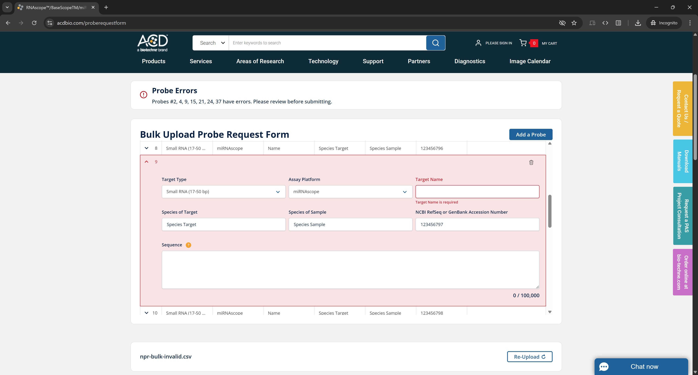

⬆️ If the CSV file contains missing value, the field is marked with an error message stating that the field is required.

<br />

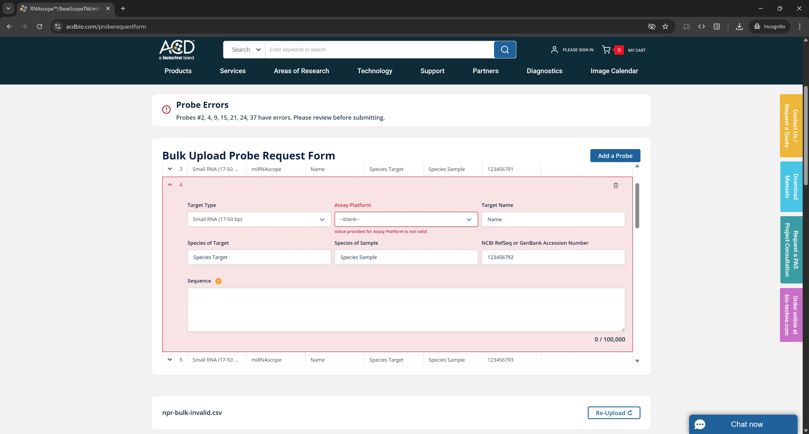

⬆️ If the CSV file contains an invalid value, a select field is left empty and an error message specifies that the app sees a value for the field in the CSV file, but it is not a valid option. The customer can then select the correct value from the dropdown. (We didn't display the invalid value because invalid options are not available in select fields.)

<br />

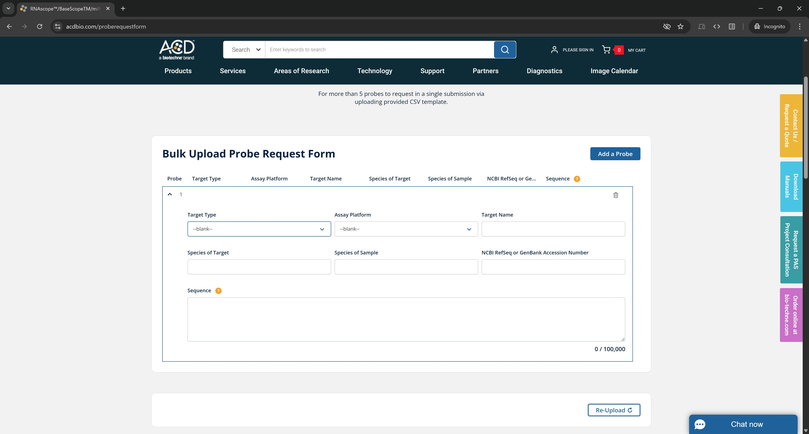

⬆️ Customers also had the option of forgoing the CSV file and enter the data manually in the table.

### Proprietary Entry

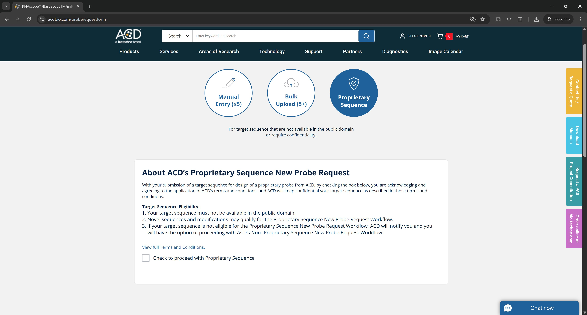

⬆️ Proprietary entry had the same flow as Manual Entry with the addition of a "Terms and Condition" acknowledgment section before the rest of the form.

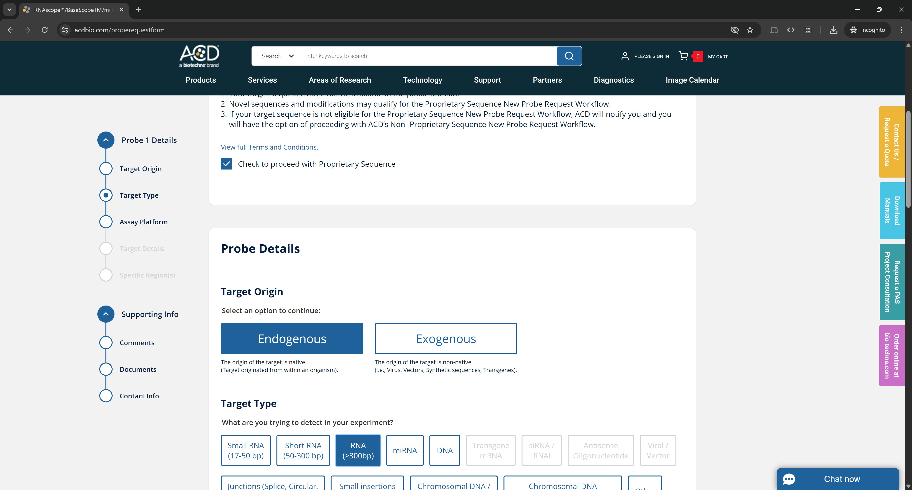

⬆️ Once the terms and conditions were accepted, the rest of the form was displayed.
