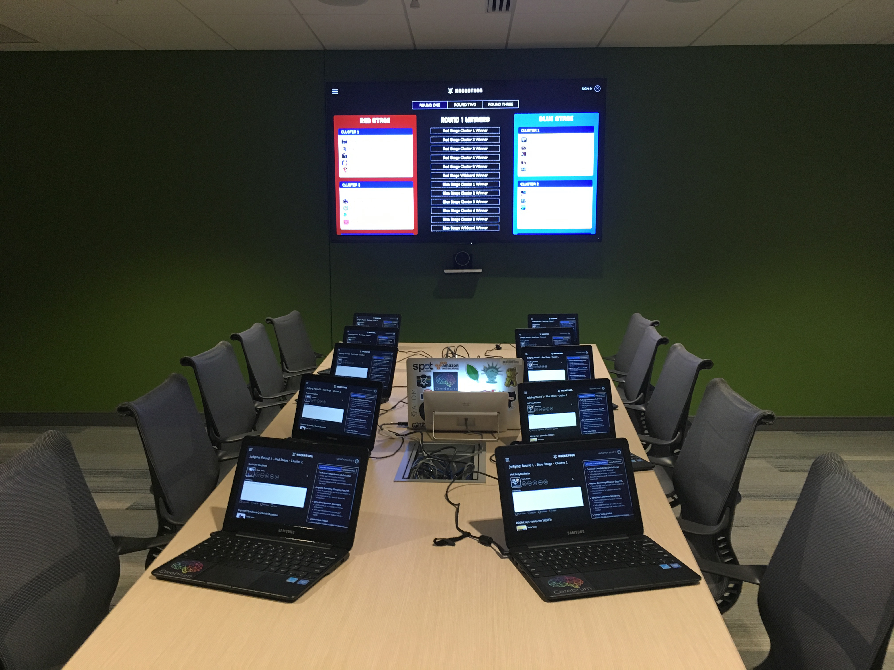
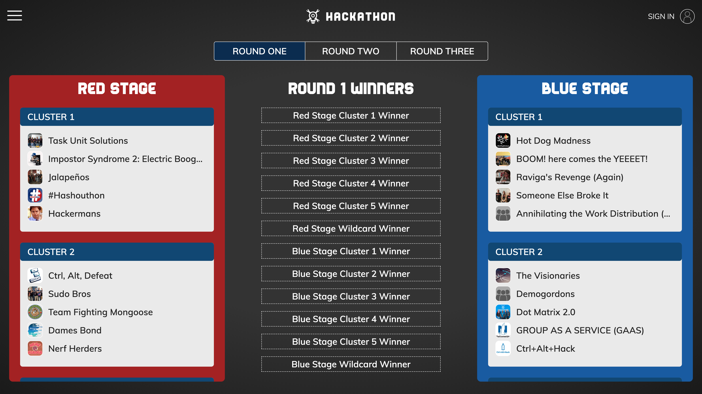
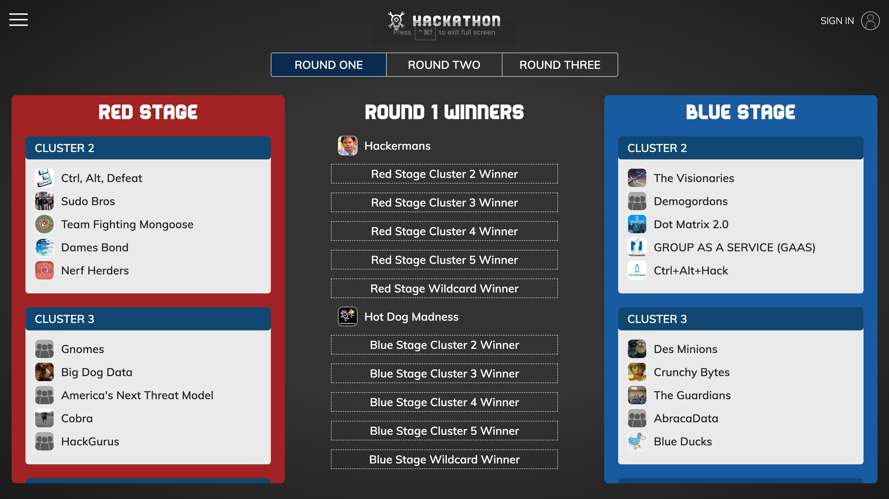
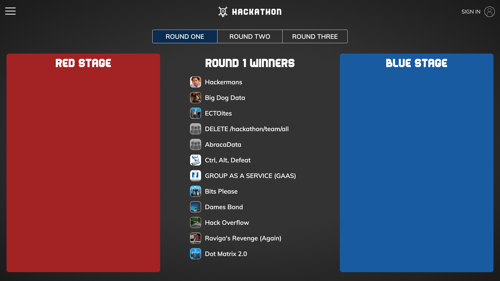
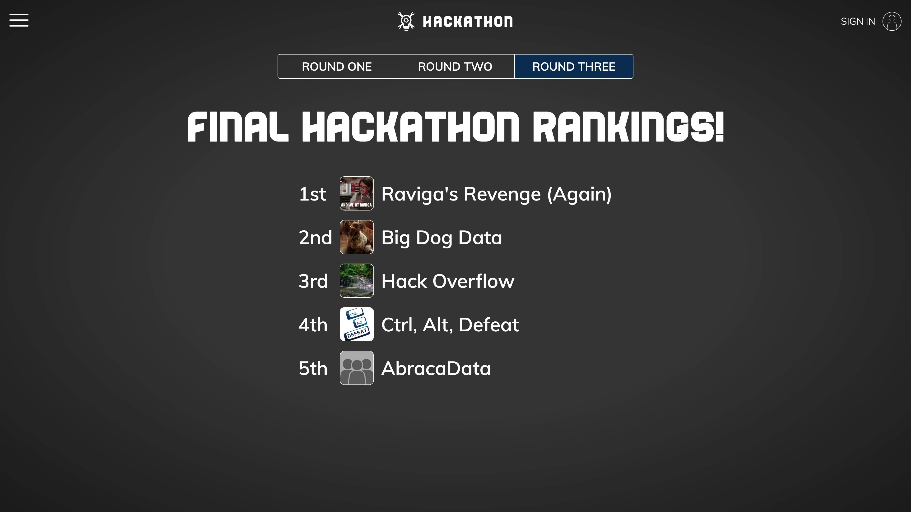
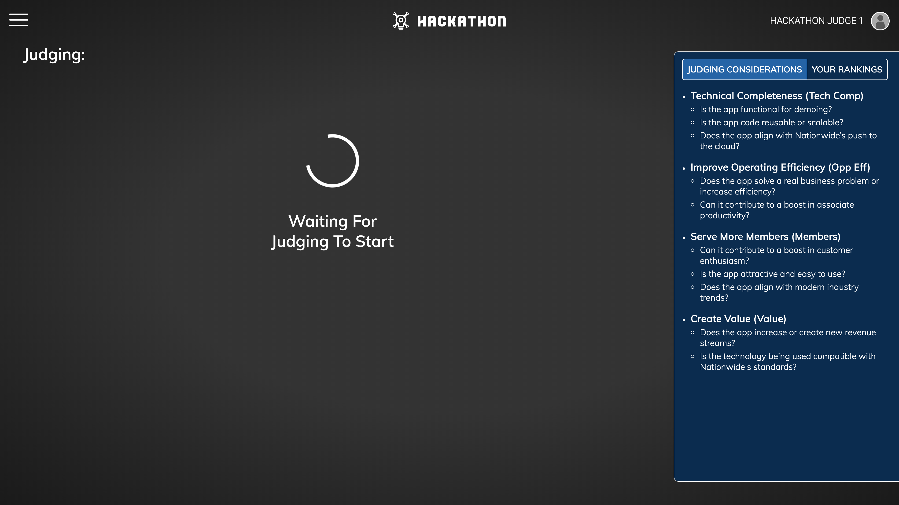
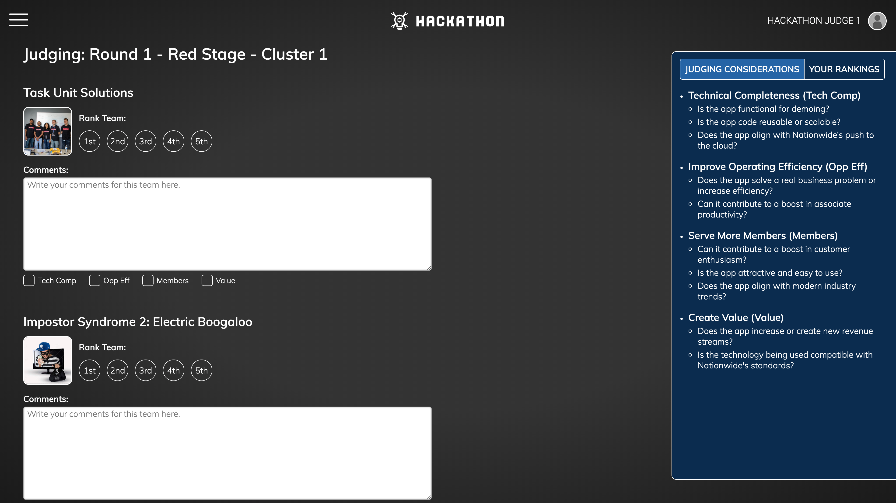
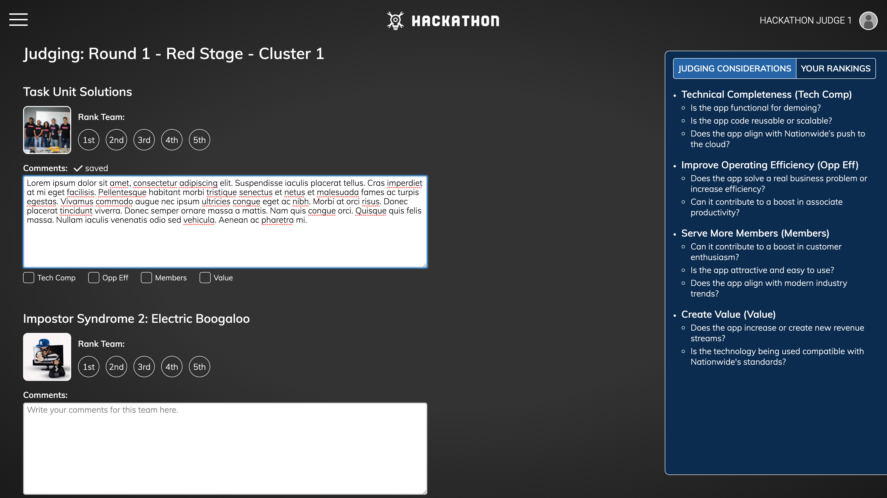
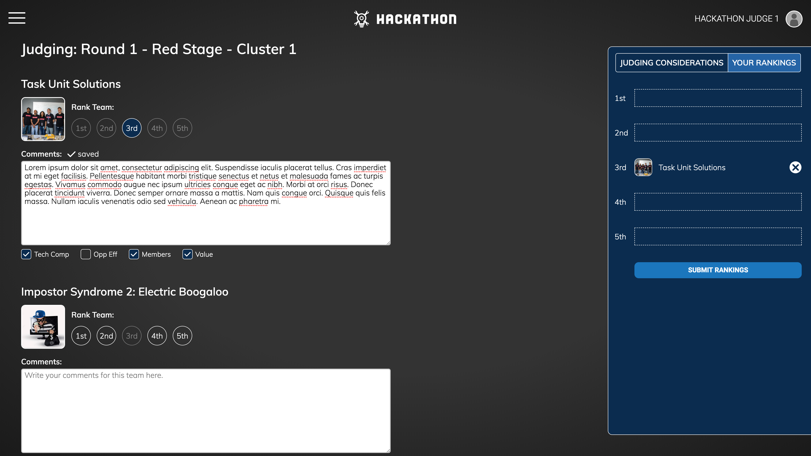
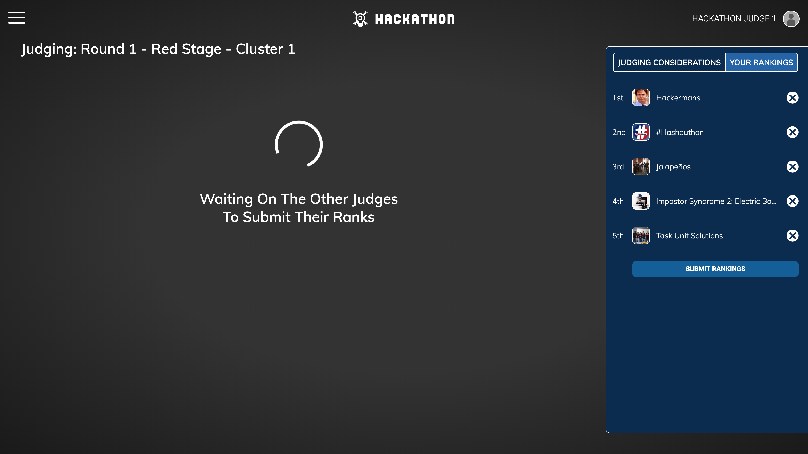

# Hackathon Judging

## Nationwide

### Summary

- ℹ️ **Problem**: The CIO and other executives desired to be judges for the final round of ranking; but their schedules were fixed. Previous hackathons had unpredictable timelines due to inefficiencies with the manual judging process.
- 💡 **Solution**: During judging, the app would display on the main stage what cluster a team was in, what stage the cluster would be presenting on, which clusters are currently presenting, and the winner of each cluster.
- 💡 **Solution**: Judges will use the app to enter their rankings, and the rankings will be tallied by the app to determine the winners. Ties will trigger a tie breaking round of scoring for the judges.
- 👨‍💼 **Role**: Determined the business requirements, broke down the stories, designed and implemented the front end, and coached 2 other part time developers with no web engineering experience on how to build the back end using model controller architecture, database schema design, and RESTful API contracts.
- 🎯 **Challenges**: Judges would NOT get a chance to test run the application before judgement day. The app needed to be intuitive to use, but no UI/UX designer was assigned to the project.
- 💻 **Technologies**: React, Express.js, Node.js, MongoDB, ESLint, Prettier, Jest, Testing Library, Amazon Web Services, EC2, S3, Route 53, CodePipeline, GitFlow.
- 🥇 **Result**: Judging was smoother and faster than any previous hackathon. The final round started right on time pleasing the executives.

### Screenshots

⬆️ We created a judging application to help manage the judging process for hackathons. This picture shows a bracket on the big screen, and the smaller laptops were handed out to judges to take notes and submit rankings.

 

⬆️ This screen is the bracket page that displayed the results of judging on the main stage. Teams were divided up evenly across 2 stages. The teams were then split up further into clusters of 5 teams apiece.

 

⬆️ When a winner for a cluster was determined they would be displayed in the middle column. Their cluster would also disappear, moving the next cluster up as the current cluster being judged on that stage.

 

⬆️ Once the middle column was full, and all the winners displayed in the middle column, the process would start again for round 2. Teams that were previously on red stage would get moved to blue, and vice versa, assuring that every winner that made it to the final round was judged by every judge.

 

⬆️ For the final round, the top 5 teams would get judged by a new panel of executive judges who would determine the final rankings.

 

⬆️ This screen is what judges would see. Each judge had their own chromebook. First they would see a loading screen before judging started.

 

⬆️ Once judging started judges would see this screen. On the right is judging criteria. On the left is a list of each team, with a textbox where judges can take notes.

 

⬆️ Any notes that judges entered were automatically saved to a backend server (as indicated by the saving account that is above the text box). Page refreshes would not cause a loss of notes.

 

⬆️ Once the notes were saved, the saving icon would disappear and be replaced by a saved icon.

 

⬆️ Checkboxes below the comments field are associated with the requirements on the right. Judges could check these off if they felt a team met those requirements.

 

⬆️ After all teams have presented judges could rank the teams. As soon as the first team was ranked the panel on the right automatically swapped to a rankings list where a judge could see their rankings listed in order. When a rank was selected for one team (Ex: Task Unit Solutions) the rest of the teams had that ranking dimmed (Ex: Imposter Syndrome). However, the buttons were NOT disabled. The buttons could still be selected for a different team resulting in the previous team to have no ranking and their spot replaced on the list to the right. To deselect a ranking, a Judge could select the x on the right, or click on the blue circle rank button which would cause it to be de-selected. 

The judges didn't have time to practice with the app before using it. The idea was to make the app easy enough to use that no time was wasted on learning how to use it.

 

⬆️ Once all the teams were ranked a judge would submit their ranks, at which point they would be shown a screen that said "waiting on the other judges to submit their ranks". If the rankings resulted in a tie only the tied teams would show up with the judge's previous notes where the judges could submit the rankings for only the tied teams.
