# Hackathon Registration

## Nationwide

### Summary

- ℹ️ **Problem**: Many interested participants registered for the previous hackathons without belonging to a team.
- 💡 **Solution**: Require team leaders to register a team, and each participant individually verify they are participating before the app marks their team as registered.
- 💡 **Solution**: Teams that lacked the required number of verified members were made public to help interested participants discover them and pair up.
- 👨‍💼 **Role**: Determined the business requirements, broke down the stories, designed and implemented the front end, and coached 2 other part time developers with no web engineering experience on how to build the back end using model controller architecture, database schema design, and RESTful API contracts.
- 🎯 **Challenges**: Managing registration state. Teams were NOT registered until they had enough confirmed members. Teams were put on warning if the lost members after being registered. Also management of a waitlist based on registration state changes.
- 💻 **Technologies**: React, Express.js, Node.js, MongoDB, ESLint, Prettier, Jest, Testing Library, Amazon Web Services, EC2, S3, Route 53, CodePipeline, GitFlow.
- 🥇 **Result**: Had more participants (fuller teams) than previous hackathons.

### Screenshots

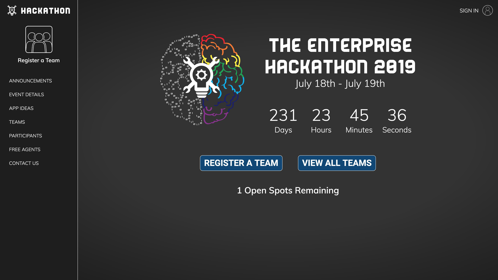
⬆️ This is the home page of the application. There is a countdown to the next event, and a message about how many spots are left before registration is full

 

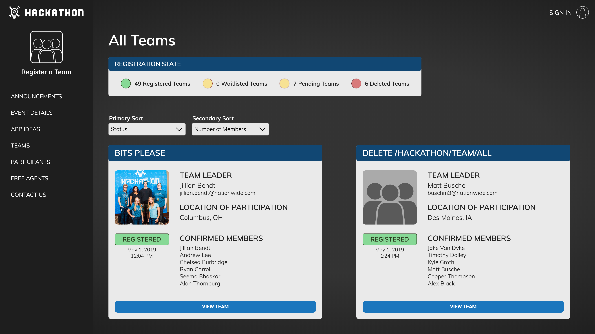
⬆️ Any user of the application could view and sort all the teams that have been created, what the registration status of each team is, the emails of team members, and what the overall status of registration is. Users who were interested in participating, but didn't have their own team to field, could reach out to existing teams and request to join.

 

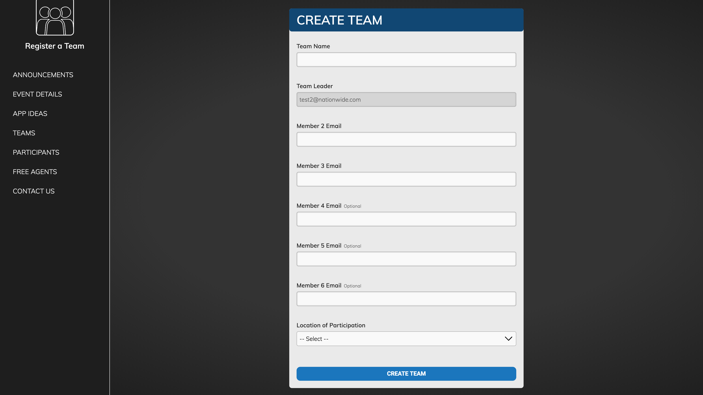
⬆️ Users who were interested in forming a team could sign in and create a team.

 

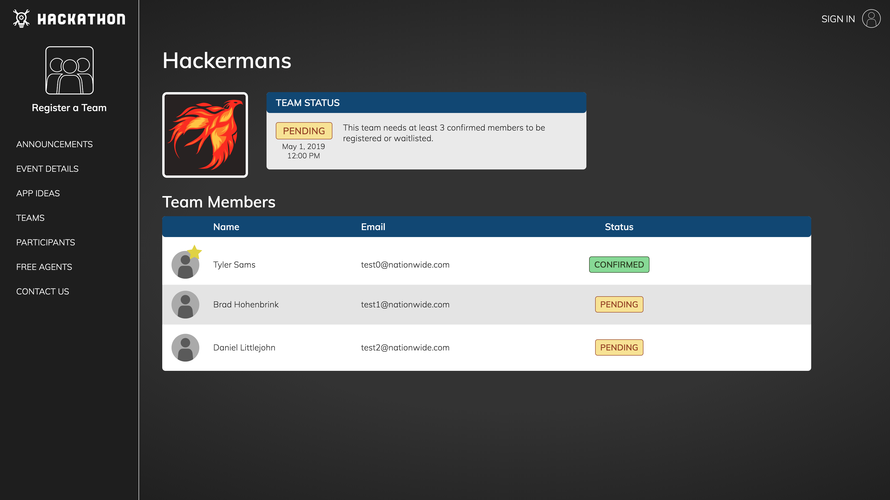
⬆️ Upon creation the team's registration status would be set to "pending" and the leader's invite status would be set to "confirmed". All other team members invite status would be set to "pending".

 

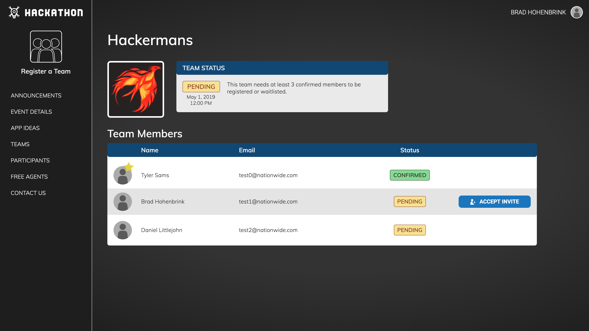
⬆️ Users who were invited to join a team would receive an email with a link to the application. Once they signed in, they would see this screen where they could accept the invitation.

 

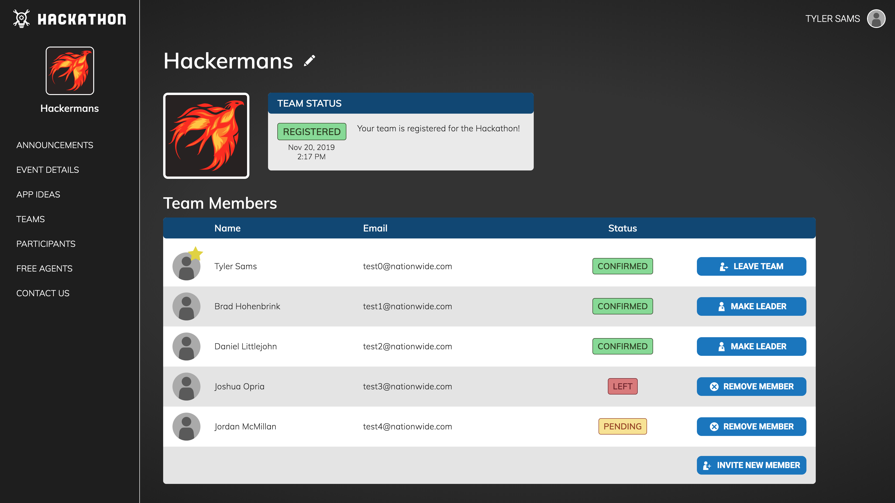
⬆️ Once enough members had accepted the invitation the teams registration status would be set to "registered" if there were still open spots, or "waitlisted" if registration was full. (This view of the team is from the team leader perspective, showing all the controls they had over the team.)

 

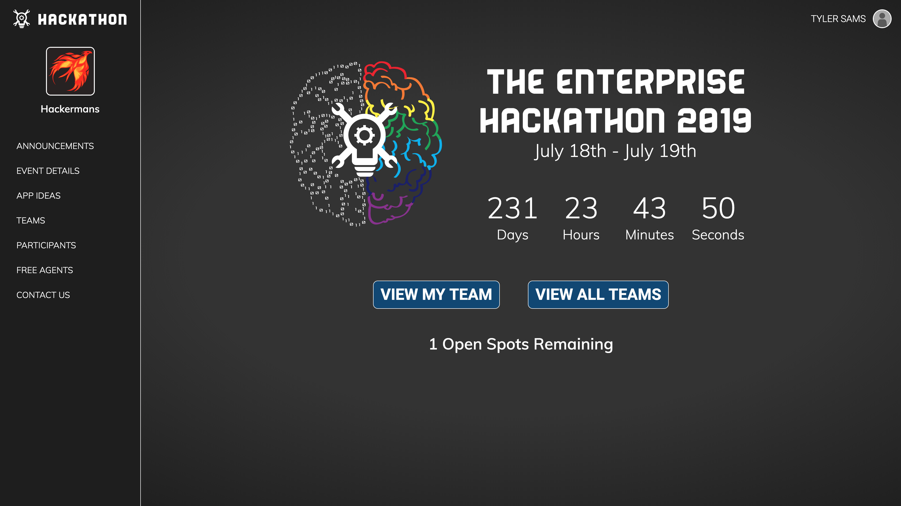
⬆️ Here is a view of what the homepage looked like for any user who was on a team.

 

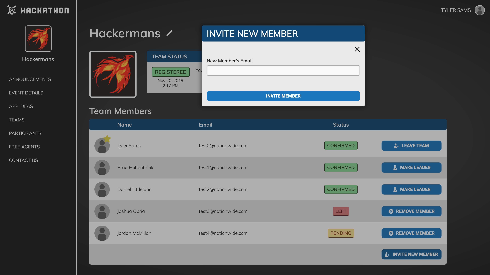
⬆️ The team leader could invite more members to join their team after team creation

 

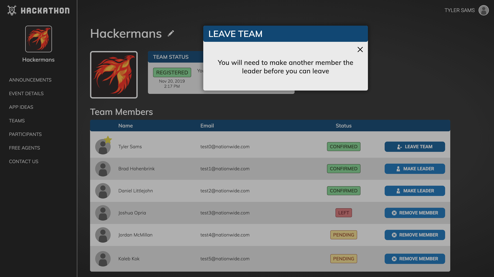
⬆️ If a team leader wanted to leave their team, they would first need to assign a new team leader. Once they did that, they would be able to leave the team.

 

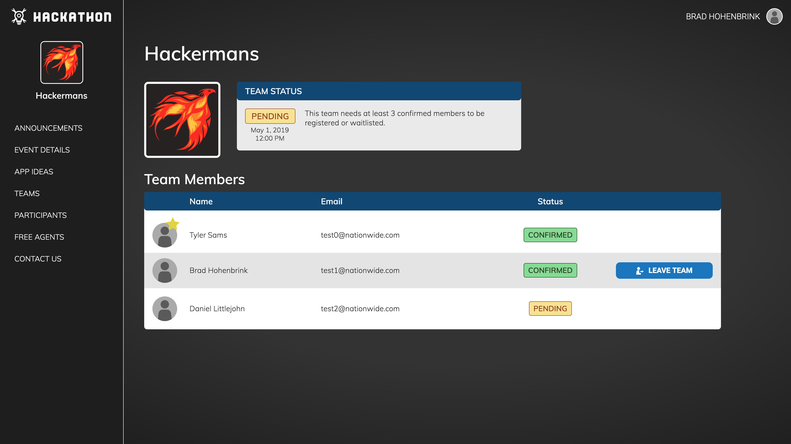
⬆️ Members had the ability to leave the team at any time.

 

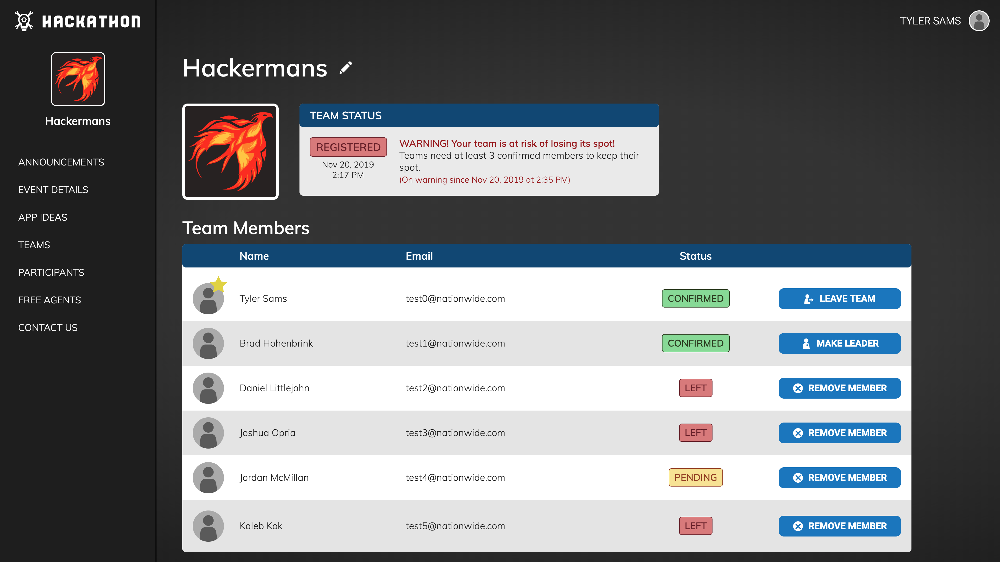
⬆️ If enough members left the team the team would remain registered, but would be put on "warning". All members would be notified of this status change. The team leader had the chance to refill the team. If that was not possible, and admin would lower the teams status to "pending", and another team from the waitlist would be moved up to fill the open slot.

 

⬆️ Once registration was full, the home page would switch from showing the number of open slots to showing the number of teams on the waitlist.

{/* 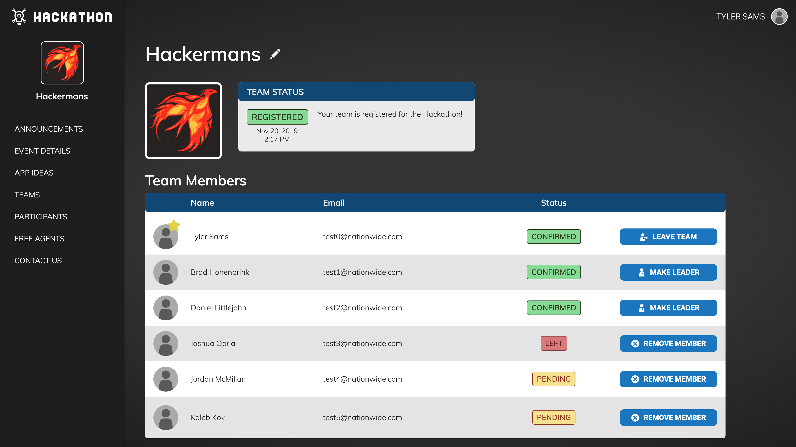 */}
{/* 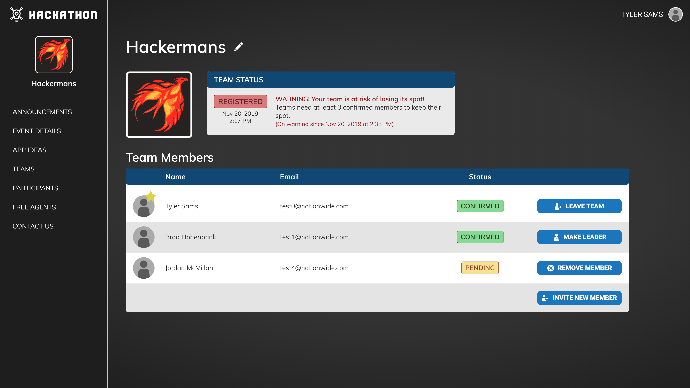 */}
{/* 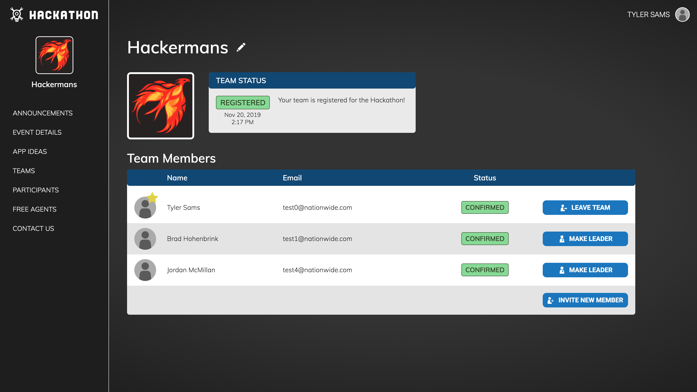 */}
