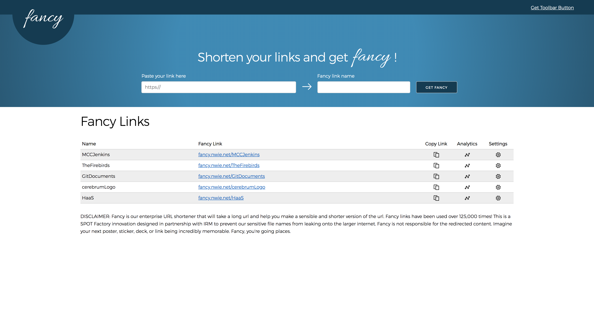
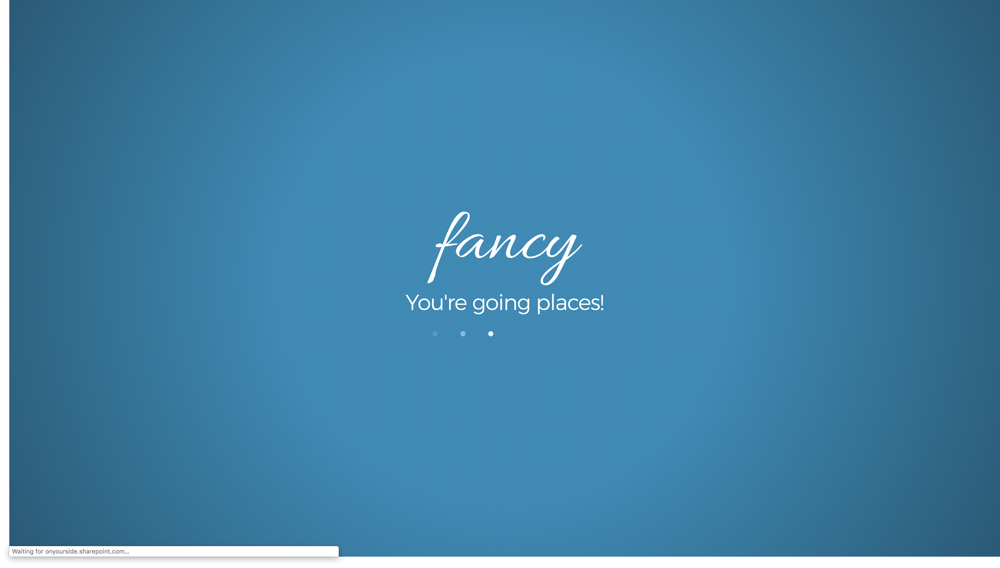
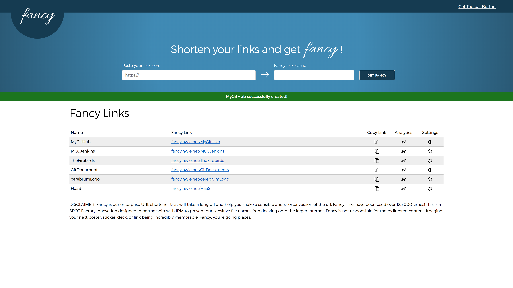
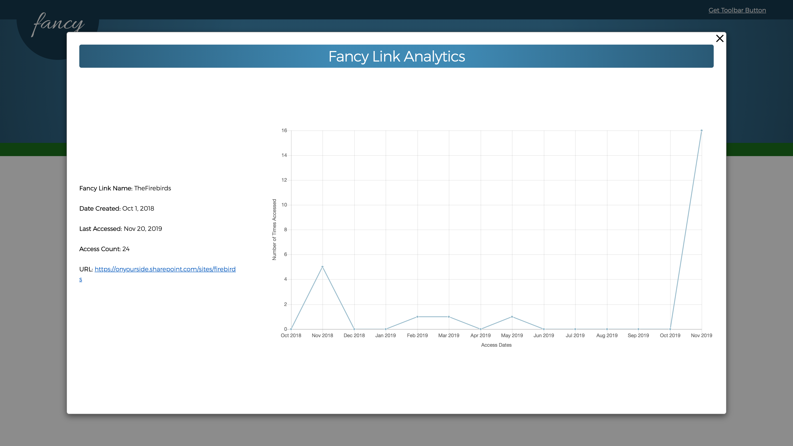
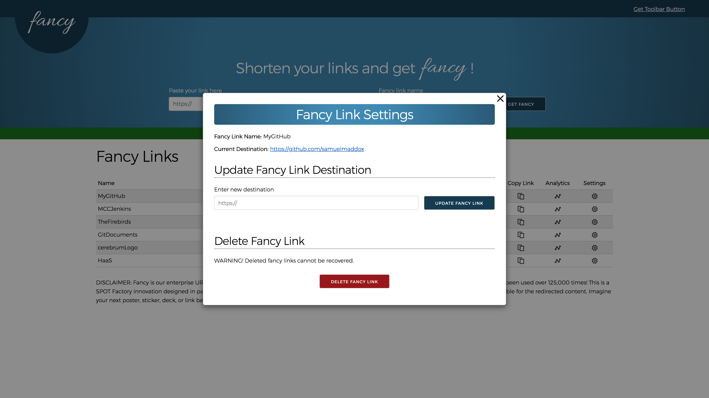
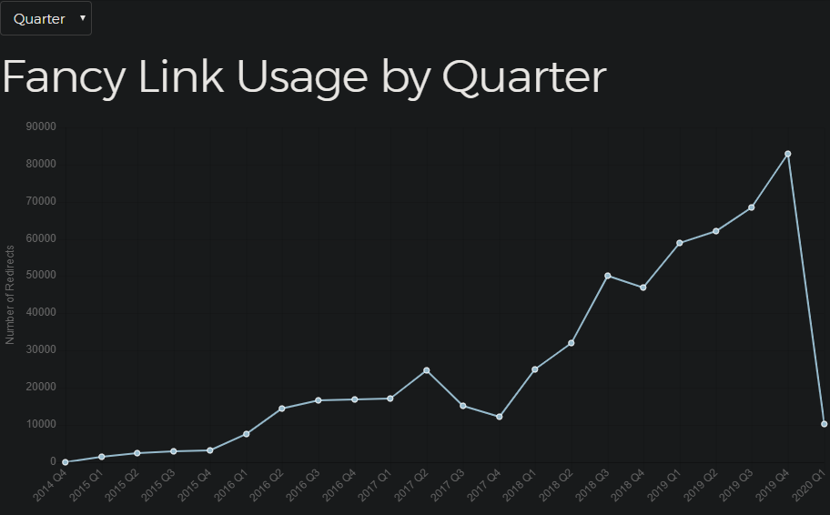

# Fancy URL Shortener

## Nationwide

### Summary

- ℹ️ **Problem**: An internal url shortening app was built using SharePoint Framework. The product desired a rebuild of the application utilizing more widely adopted technologies.
- 💡 **Solution**: Sharepoint On-Premise was being migrated to SharePoint 365, providing an opportunity for a rewrite using MEAN stack technologies.
- 👨‍💼 **Role**: I was the sole developer/designer for this rewrite as a new hire fresh out of college.
- 🎯 **Challenges**: I had never built anything using MongoDB, Express.js, AngularJS, or Node.js. Senior devs were very busy with the migration of sharepoint, leaving me mostly on my own.
- 💻 **Technologies**: MongoDB, Express.js, AngularJS, or Node.js, Amazon Web Services, EC2, Route 53, CodePipeline, GitFlow
- 🥇 **Result**: Successfully rewrote and deployed the application with a modernized UI/UX, and a new link usage analytics feature for users and admins.

### Screenshots

⬆️ Fancy is a URL shortener application where users can turn long ugly links `https://docs.aws.amazon.com/en_pv/lambda/latest/dg/welcome.html` into shorter, more memorable links known as fancy links `fancy.nwie.net/AWSLambdaDocs`.

 

⬆️ When fancy links are clicked the user first gets redirected to a splash page that markets the application, and then continues on to the link's final destination.

 

{/*  */}

⬆️ To create a user would fill out the form. Once a link is created a green bar pops up to confirm a successful create and the link is added to their table below.

 

⬆️ Users can view a chart that displays usage of their links over time. If the link is young the chart displays usage over days. When the link gets old enough the chart simplifies from days to months.

 

⬆️ A link's settings page where a fancy link's destination can be updated or the link can be deleted.

 

⬆️ This is a chart showing how often fancy links were used since the launch of Fancy v1. Screen shot was taken in January 2020. My version of Fancy launched in Q4 of 2017.
